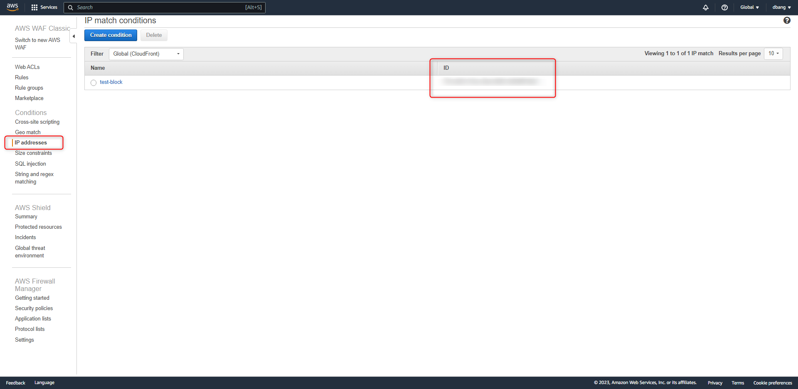

+++
author = "Hugo Authors"
title = "AWS- update-ip-set to block based IP address for WAF"
date = "2022-09-08"
description = "可用於腳本 API"
categories = [
    "AWS"
]
tags = [
    "AWS",
]
image = "100.png"
+++

{Step 1} 獲取 `Token` [GetChangeToken]

##### 對WAF進行操作時,需要有一個Token,以防止衝突的請求 

```yaml
/usr/bin/aws waf get-change-token|jq -r '.ChangeToken'

```
    $Token = c93e119c-607e-43b5-98e3-66d3XXXXXXX
    
{Step 2} 取得 `IP address ID`

 
 
    $addressID = XXXXXXXXX791cd453-01ba-46ed-8863
 
API :

```yaml
/usr/bin/aws waf update-ip-set --ip-set-id  $addressID  --change-token $Token --updates Action="INSERT",IPSetDescriptor='{Type="IPV4",Value=" XX.XX.XX.XX/32"}'

```


參考: https://docs.aws.amazon.com/cli/latest/reference/waf/update-ip-set.html


***


<style>
.emojify {
	font-family: Apple Color Emoji, Segoe UI Emoji, NotoColorEmoji, Segoe UI Symbol, Android Emoji, EmojiSymbols;
	font-size: 2rem;
	vertical-align: middle;
}
@media screen and (max-width:650px) {
  .nowrap {
    display: block;
    margin: 25px 0;
  }
}
</style>

