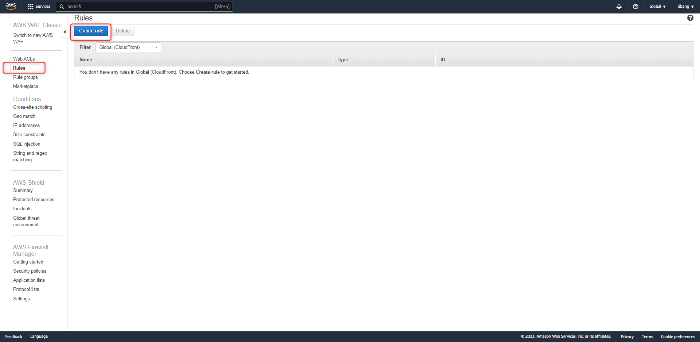
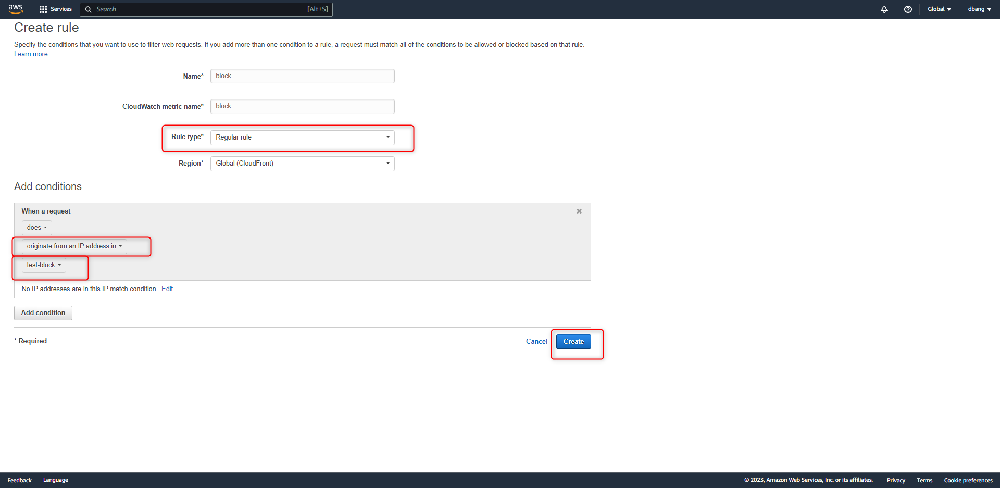
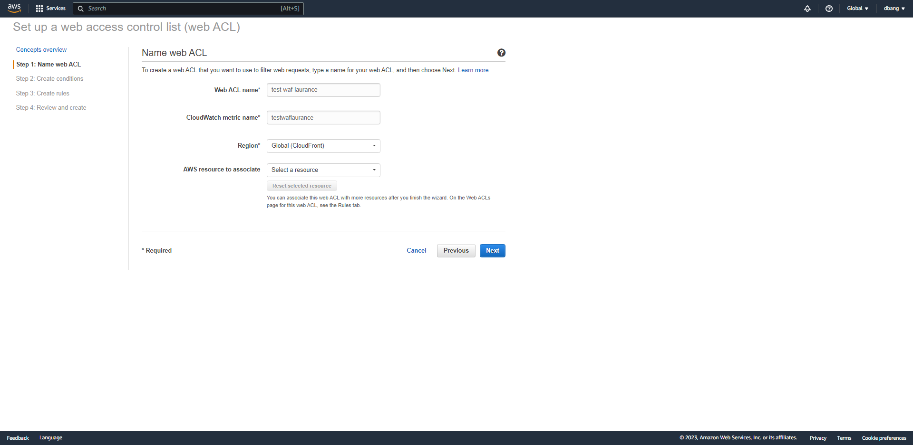
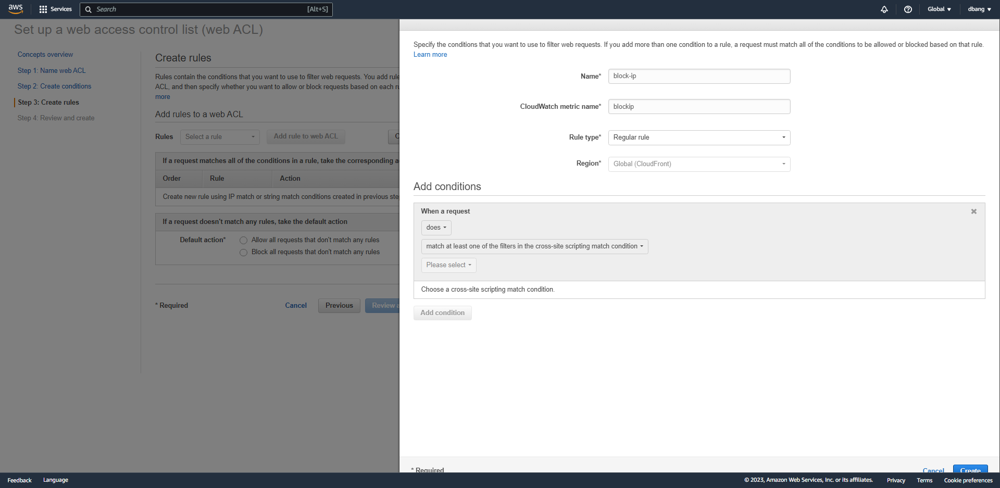

+++
author = "Hugo Authors"
title = "AWS - WAF & Rules 建置"
date = "2022-09-08"
description = "( 封鎖 IP 政策 )"
categories = [
    "AWS"
]
tags = [
    "AWS",
]
image = "100.png"
+++

{Step 1} 建立 `IP match conditions`

 
 
{Step 2} 輸入名稱 , 區域 , 要封鎖的 IP

 
  
 
{Step 3} 建立 `Rules` 

 
 
{Step 4} 輸入名稱 , 規則 , 掛進剛建立的 `IP match conditions`

 
 
{Step 5} 編輯 `Web ACL`  將剛建立的 `Rules` 掛入

 
 

---

# Web ACL 建置

點選 `Create web ACL` 區域選 `Global CloudFront`

 
 
輸入名稱 , Cloudwatch metric 名稱 (這兩個名稱之後無法更改)

 
 
選擇該 WAF 政策

 
 
選擇該 WAF 規則

 
 
 
建立

 

***




