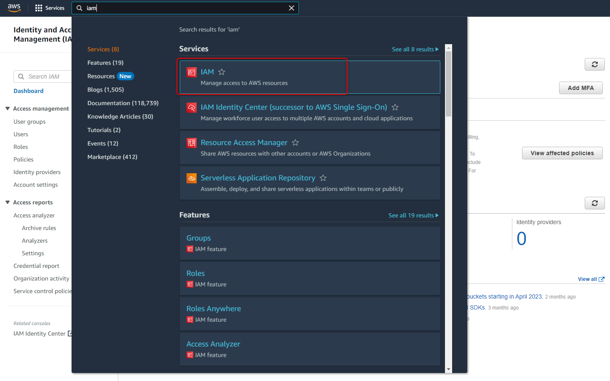
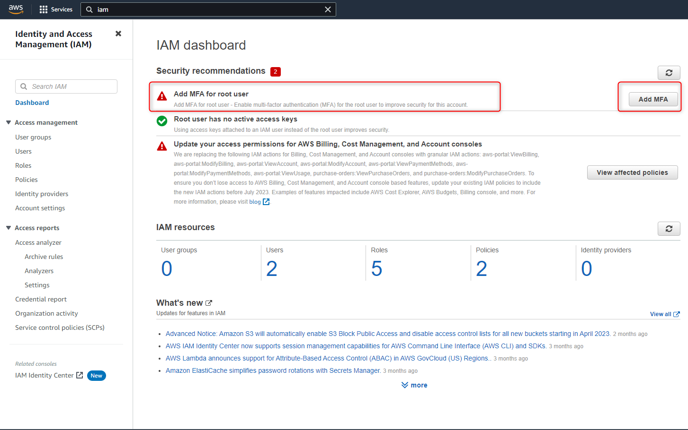
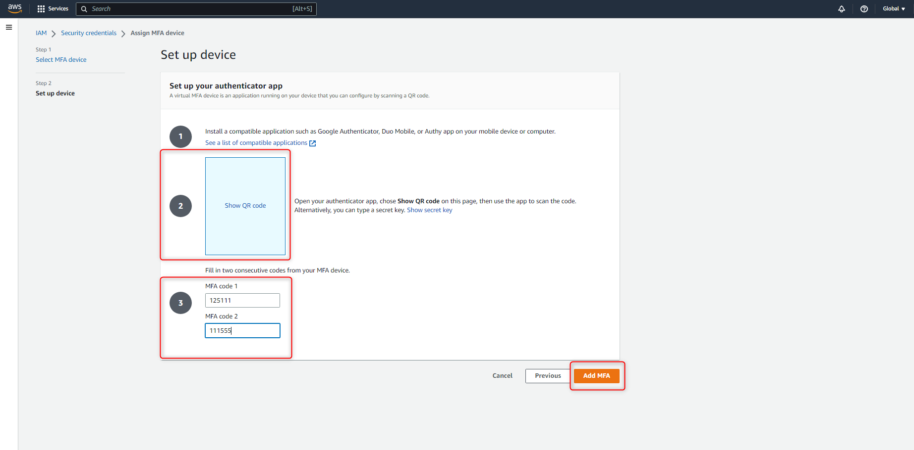
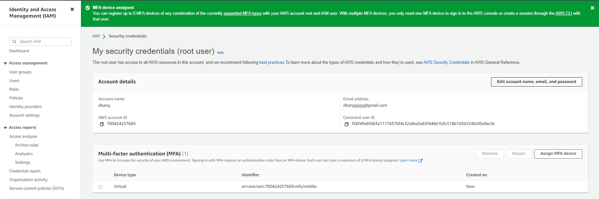

+++
author = "Hugo Authors"
title = "AWS-How to enable MFA for AWS Root user"
date = "2022-08-05"
#description = ""
categories = [
    "AWS"
]
tags = [
    "AWS",
]
image = "100.png"
+++

# 設置 AWS-MFA - 二階段認證 Authy

{Step 1} 搜尋 `IAM` 服務

{Step 2} 選擇 `Add MFA` 添加 MFA

{Step 3} 在選單 `Multi-factor authentication (MFA)` 中新增設備 `Assign MFA device`

{Step 4} 選擇要驗證MFA的方式 ( 這邊選擇使用APP )

{Step 5} 點擊 `show QR code` 並使用手機APP (Authy) 掃描驗證 & 並將驗證碼依序填入 `MFA code1 , MFA code2`

{Step 6} 添加成功

***




