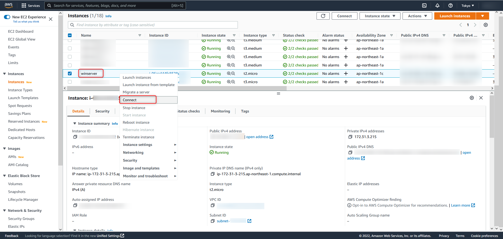
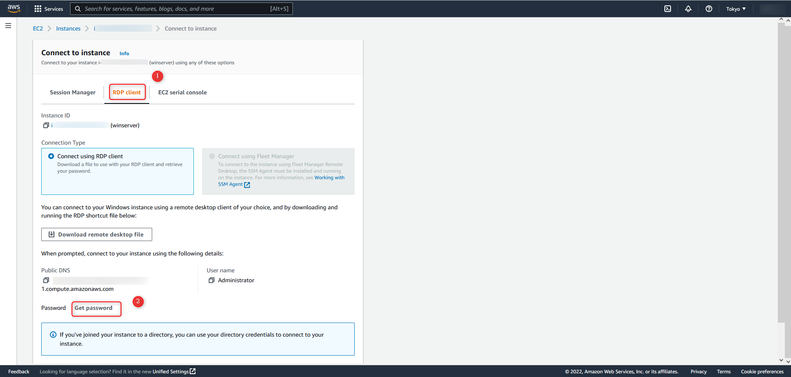
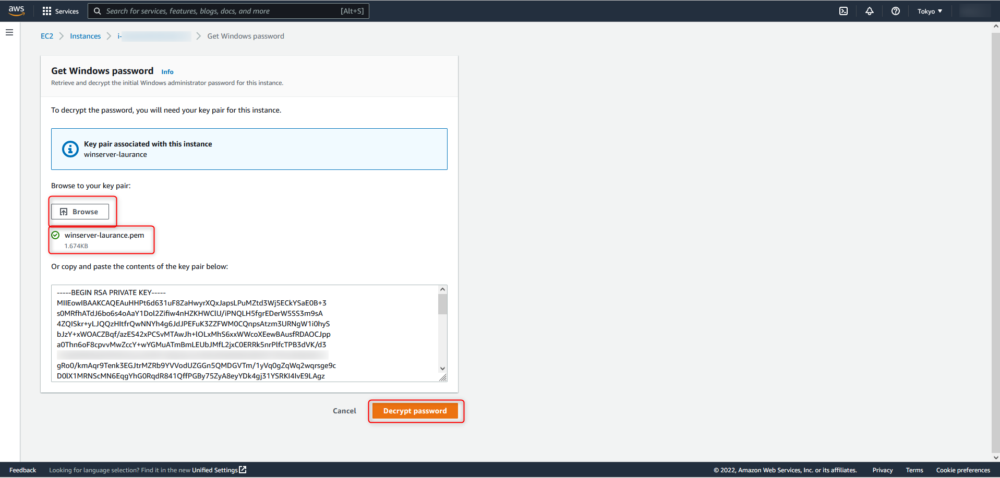
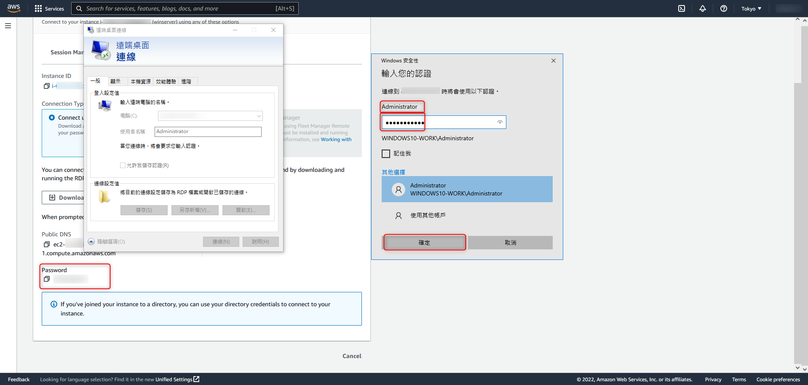

+++
author = "Hugo Authors"
title = "AWS-連線至 windows-ec2"
date = "2022-10-18"
description = "使用RDP協議遠端桌面連線至 EC2-Windows"
categories = [
    "AWS"
]
tags = [
    "AWS",
]
image = "100.png"
+++

    在新建立的 Instances 右鍵選擇 Connect
    
   
   
    選擇 RDP client 並點選 Get password
    
   
   
    選擇 Browse (瀏覽) 並選取製作 instance 的金鑰 (.pem) 並選擇 Decrypt Password (解密密碼)
    
   
   
    使用後台給的亂數密碼建立遠端桌面連線 (帳號預設都是 Administrator)
    
   
   
   [官方文件連結](https://docs.aws.amazon.com/zh_tw/AWSEC2/latest/WindowsGuide/connecting_to_windows_instance.html)
   
   

***




