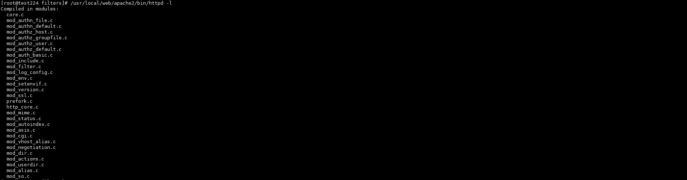
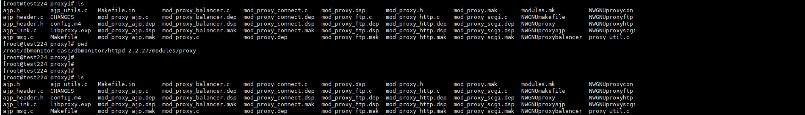
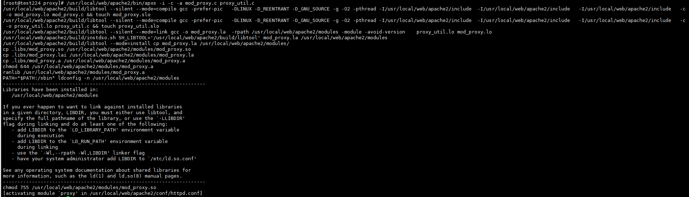

+++
author = "Hugo Authors"
title = "Apache-透過 apxs 添加 proxy 模块"
date = "2022-12-03"
description = "必須內建了mod_so模塊，即編譯時有--enable-so"
categories = [
    "Web"
]
tags = [
    "Apache",
]
image = "100.png"
+++

查看所有模塊

    /usr/local/web/apache2/bin/httpd -l
    
   
   
進入proxy moudle 編碼目錄

    cd /root/dbmonitor-case/dbmonitor/httpd-2.2.27/modules/proxy
    
   
   
使用apxs進行編譯安裝

    /usr/local/web/apache2/bin/apxs -i -c -a mod_proxy.c proxy_util.c

   

***




