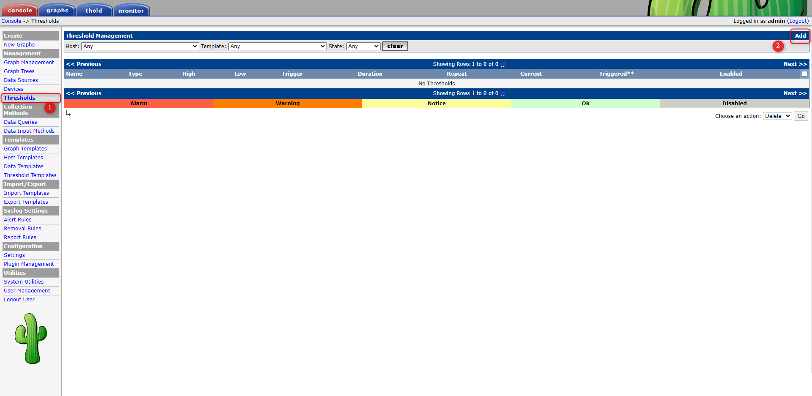
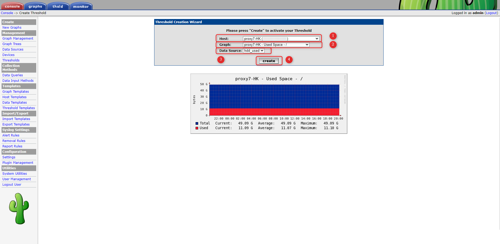
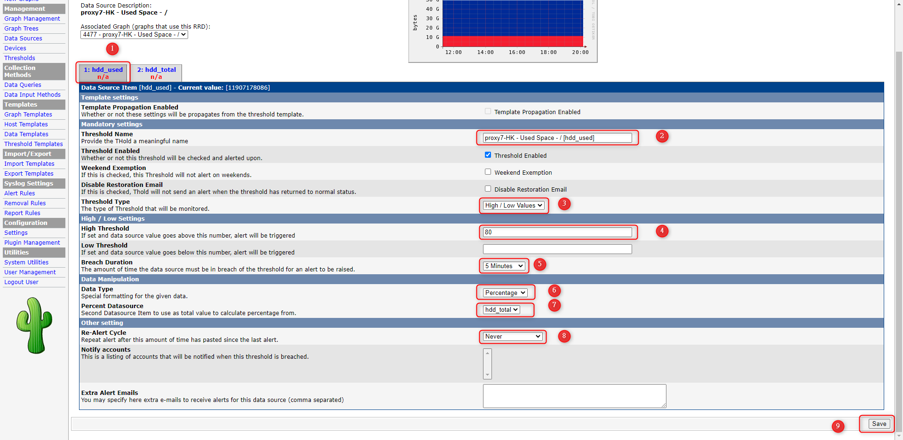

+++
author = "Hugo Authors"
title = "Cacti-新增機器監控"
date = "2022-10-14"
#description = "(新建EC2加入Cacti監控)"
categories = [
    "Cacti"
]
tags = [
    "Cacti",
]
image = "100.jpg"
+++

    1. Cacti 後台選 Thresholds >> Add
    
   
   
    2. 寫入機器資訊 (Host , Graph , Data Source)
    
   
   
    3. 設定監控相關參數
    
   
   
   

***




