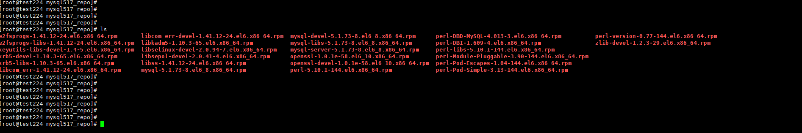

+++
author = "Hugo Authors"
title = "CentOS-如何將安裝包及其依賴包下載到本地"
date = "2023-01-26"
#description = "(Centos 安装 speedtest-cli網速測試)"
categories = [
    "Linux"
]
tags = [
    "CentOS",
]
image = "100.png"
+++

# 通過 yum 命令的 Downloadonly 插件下載 RPM 軟件包及其所有依賴包

安裝工具包

    yum install yum-plugin-downloadonly yum-utils -y
    
將 *.repo 安裝到指定目錄下

    yum install --downloadonly + --downloaddir=軟件包位置[可選] + 軟件包名(可加上版本號，指定版本)
    
    yum install --downloadonly --downloaddir=/root/mysql517_repo/ mysql-server mysql-client mysql-devel*
    

***




