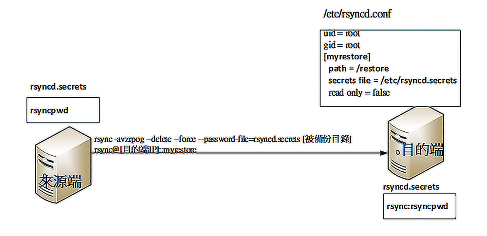

+++
author = "Hugo Authors"
title = "CentOS7上使用Rsync不同機器備份"
date = "2022-10-27"
#description = ""
categories = [
    "rsync"
]
tags = [
    "rsync",
]
image = "100.png"
+++

   
   
    接收方 (目的):
    172.16.0.222
    
    服務需開啟:
    rsync --daemon --config=/etc/rsyncd.conf
    
    設定檔:
    [update]
    path =          /root/iptables 		# (位置寫死)
    auth users =    update
    hosts allow =   172.16.0.223
    uid =           root
    gid =           root
    secrets file =  /etc/rsync5.secrets
    read only =     no
    
    密碼放置及格式:
    vim /etc/rsync5.secrets
    update:qwe999 (格式)
    
    --------------------------------------------
    
    發送方 (來源):
    172.16.0.223
    
    服務不用開啟
    
    需建置密碼
    vim /etc/rsync5.secrets
    qwe999 (格式)
    
    同步語法:
    
    rsync -aHSz --password-file=/etc/rsync5.secrets /root/iptables update@172.16.0.222::update

***




