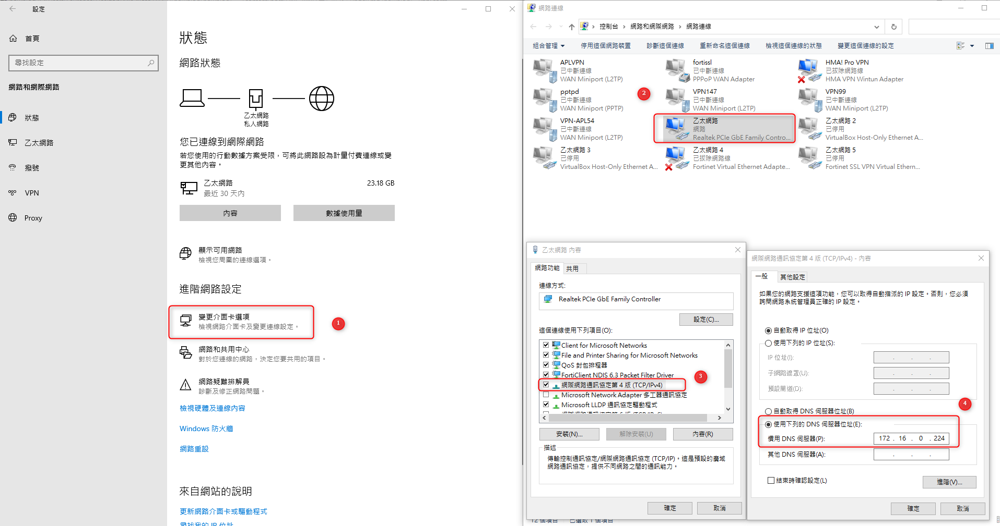
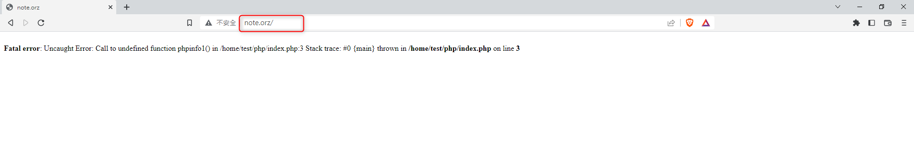

+++
author = "Hugo Authors"
title = "DNS_SERVER-BIND 安裝與設定"
date = "2022-12-03"
#description = ""
categories = [
    "Web"
]
tags = [
    "DNS",
]
image = "100.png"
+++


安裝相關依賴及Server

    yum -y install bind bind-chroot bind-utils bind-libs caching-nameserver
        
複製必要檔案至新路徑並給予權限

    cp /var/named/named.*  /var/named/chroot/var/named/
    
    chown root.named /var/named/chroot/var/named/named.*

    cp -r /var/named/data/ /var/named/chroot/var/named/
    
    chown named.named /var/named/chroot/var/named/data/ -R

更改主設定檔

    vim /etc/named/named.conf
    
```angular2html

//
// named.conf
//
// Provided by Red Hat bind package to configure the ISC BIND named(8) DNS
// server as a caching only nameserver (as a localhost DNS resolver only).
//
// See /usr/share/doc/bind*/sample/ for example named configuration files.
//
// See the BIND Administrator's Reference Manual (ARM) for details about the
// configuration located in /usr/share/doc/bind-{version}/Bv9ARM.html

options {
	listen-on port 53 { any; }; //監聽多個介面的port53
#	listen-on-v6 port 53 { ::1; }; //關閉IPV6
	directory 	"/var/named/chroot/var/named"; //位置改為/chroot/var/named
	dump-file 	"/var/named/data/cache_dump.db"; //統計資料存放路徑
	statistics-file "/var/named/data/named_stats.txt"; //統計資料存放路徑
	memstatistics-file "/var/named/data/named_mem_stats.txt"; //統計資料存放路徑
#	recursing-file  "/var/named/data/named.recursing";
#	secroots-file   "/var/named/data/named.secroots";
	allow-query     { any; }; //限制有那些用戶可以使用此台DNS
	forwarders 	{8.8.8.8;}; //dns伺服器無法解析時，會由8.8.8.8解析

	/* 
	 - If you are building an AUTHORITATIVE DNS server, do NOT enable recursion.
	 - If you are building a RECURSIVE (caching) DNS server, you need to enable 
	   recursion. 
	 - If your recursive DNS server has a public IP address, you MUST enable access 
	   control to limit queries to your legitimate users. Failing to do so will
	   cause your server to become part of large scale DNS amplification 
	   attacks. Implementing BCP38 within your network would greatly
	   reduce such attack surface 
	*/
	recursion yes; //遞迴式，如果本 DNS server 查不到，會往上層查

	dnssec-enable no; //設定不回傳 DNS Security Extensions ( DNSSEC ) 相關的 RR
	dnssec-validation no; //設定RR 不經由 DNSSEC 認證

	/* Path to ISC DLV key */
	bindkeys-file "/etc/named.root.key";

	managed-keys-directory "/var/named/dynamic";

#	pid-file "/run/named/named.pid";
#	session-keyfile "/run/named/session.key";
};

logging {
        channel default_debug {
                file "data/named.run";
                severity dynamic;
        };
	category lame-servers { null; };
};

zone "." IN {
	type hint;
	file "named.ca";
};


include "/etc/named.rfc1912.zones";
include "/etc/named.root.key";


```    
    
重啟服務

    systemctl restart named
    
    
[BIND 新增 zone及解析] 

   在主設定檔新增zone
   
    vim /etc/named.conf
   
```angular2html

zone "orz" IN {
        type master;
        file "orz.zone";
};
``` 

   在新路徑中新增zone紀錄
   
    vim /var/named/chroot/var/named/orz.zone
    
```angular2html

$TTL 86400
@       IN      SOA     @ rname.invalid. (
                        2017030903
                        1D
                        1H
                        1W
                        3H )

                        NS      localhost.
note
```
    
[WINDOWS 驗證:]

   將windows 網卡DNS設定為 DNS-SERVER 172.16.0.222
    
   
   
   不用綁 hosts 即可訪問
   
   
   
    
***


<style>
.emojify {
	font-family: Apple Color Emoji, Segoe UI Emoji, NotoColorEmoji, Segoe UI Symbol, Android Emoji, EmojiSymbols;
	font-size: 2rem;
	vertical-align: middle;
}
@media screen and (max-width:650px) {
  .nowrap {
    display: block;
    margin: 25px 0;
  }
}
</style>

