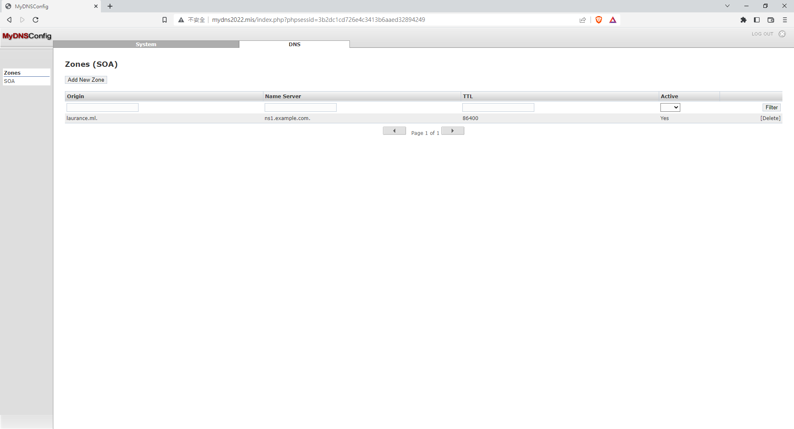

+++
author = "Hugo Authors"
title = "DNS_SERVER-MyDNS 服務器的可視化管理 by CentOS6"
date = "2022-12-30"
description = "(MySQL -5.0.77 + Apache-2.2.27 + PHP-5.2.5 + MyDNSConfig-1.1.0 + mydns-1.2.8.31)"
categories = [
    "Web"
]
tags = [
    "DNS",
]
image = "100.png"
+++

# 安裝順序為 MySQL > Apache > PHP > MyDNSConfig > mydns

# 安裝以下套件所需依賴包

    yum -y install gcc gcc-c++  make cmake automake autoconf kernel-devel ncurses-devel libxml2-devel openssl-devel curl-devel libjpeg-devel libpng-devel  pcre-devel libtool libtool-libs freetype-devel gd zlib-devel file bison patch mlocate flex diffutils   readline-devel glibc-devel glib2-devel bzip2-devel gettext-devel libcap-devel openldap openldap-devel libxslt-devel sqlite-devel  libevent libevent-devel

# MySQL -5.0.77 : 

[MySQL官網安裝包] https://downloads.mysql.com/archives/community/

下載安裝包

    wget https://downloads.mysql.com/archives/get/p/23/file/MySQL-server-community-5.0.77-0.rhel5.x86_64.rpm
    
    wget https://downloads.mysql.com/archives/get/p/23/file/MySQL-client-community-5.0.77-0.rhel5.x86_64.rpm
    
    wget https://downloads.mysql.com/archives/get/p/23/file/MySQL-devel-community-5.0.77-0.rhel5.x86_64.rpm
    
    wget https://downloads.mysql.com/archives/get/p/23/file/MySQL-shared-compat-5.0.77-0.rhel5.x86_64.rpm

解壓

    rpm -ivh MySQL-devel-community-5.0.77-0.rhel5.x86_64.rpm
    
    rpm -ivh MySQL-shared-compat-5.0.77-0.rhel5.x86_64.rpm
    
    rpm -ivh MySQL-server-community-5.0.77-0.rhel5.x86_64.rpm
    
    rpm -ivh MySQL-client-community-5.0.77-0.rhel5.x86_64.rpm
    
查看版本

    mysql -V
    
啟動服務

    mysqld_safe &
    
設置root密碼

    mysqladmin -u root password '123456'

建立使用者及權限
    
    mysql>  GRANT all privileges ON mydns.* TO mydns@localhost IDENTIFIED BY '123456';

    mysql>  flush privileges;

建立database存放mydns

    mysql> create database mydns;

***

# Apache-2.2.27 :

下載依賴包

    wget http://archive.apache.org/dist/apr/apr-1.4.5.tar.gz  
    
    tar -zxf apr-1.4.5.tar.gz  
    
    cd  apr-1.4.5  
    
    ./configure --prefix=/usr/local/apr  
    
    make && make install 
    
   ***
   
    wget http://archive.apache.org/dist/apr/apr-util-1.3.12.tar.gz  
    
    tar -zxf apr-util-1.3.12.tar.gz  
    
    cd apr-util-1.3.12  
    
    ./configure --prefix=/usr/local/apr-util -with-apr=/usr/local/apr/bin/apr-1-config  
    
    make && make install
    
   ***
   
    wget http://jaist.dl.sourceforge.net/project/pcre/pcre/8.10/pcre-8.10.zip  
    
    unzip -o pcre-8.10.zip  
    
    cd pcre-8.10  
    
    ./configure --prefix=/usr/local/pcre  
    
    make && make install
     
解壓 Apache

    tar zxvf httpd-2.2.27.kiwi.tar.gz
    
    cd httpd-2.2.27/
    
    ./configure --prefix=/usr/local/web/apache2 --enable-ssl --enable-so  --enable-vhost-alias  --with-mpm=prefork --with-apr=/usr/local/apr/ --with-apr-util=/usr/local/apr-util/ --with-z --enable-proxy --enable-rewrite --with-pcre
    
    make && make install
        
查看版本

    /usr/local/web/apache2/bin/apachectl -v
    
更改 apache 主設定檔

    mv /usr/local/web/apache2/conf/httpd.conf /usr/local/web/apache2/conf/httpd.conf.bak
    
    vi /usr/local/web/apache2/conf/httpd.conf
    
```javascript
#
# This is the main Apache HTTP server configuration file.  It contains the
# configuration directives that give the server its instructions.
# See <URL:http://httpd.apache.org/docs/2.2> for detailed information.
# In particular, see 
# <URL:http://httpd.apache.org/docs/2.2/mod/directives.html>
# for a discussion of each configuration directive.
#
# Do NOT simply read the instructions in here without understanding
# what they do.  They're here only as hints or reminders.  If you are unsure
# consult the online docs. You have been warned.  
#
# Configuration and logfile names: If the filenames you specify for many
# of the server's control files begin with "/" (or "drive:/" for Win32), the
# server will use that explicit path.  If the filenames do *not* begin
# with "/", the value of ServerRoot is prepended -- so "logs/foo_log"
# with ServerRoot set to "/usr/local/web/apache2" will be interpreted by the
# server as "/usr/local/web/apache2/logs/foo_log".

#
# ServerRoot: The top of the directory tree under which the server's
# configuration, error, and log files are kept.
#
# Do not add a slash at the end of the directory path.  If you point
# ServerRoot at a non-local disk, be sure to point the LockFile directive
# at a local disk.  If you wish to share the same ServerRoot for multiple
# httpd daemons, you will need to change at least LockFile and PidFile.
#
ServerRoot "/usr/local/web/apache2"

#
# Listen: Allows you to bind Apache to specific IP addresses and/or
# ports, instead of the default. See also the <VirtualHost>
# directive.
#
# Change this to Listen on specific IP addresses as shown below to 
# prevent Apache from glomming onto all bound IP addresses.
#
#Listen 12.34.56.78:80
Listen 80

#
# Dynamic Shared Object (DSO) Support
#
# To be able to use the functionality of a module which was built as a DSO you
# have to place corresponding `LoadModule' lines at this location so the
# directives contained in it are actually available _before_ they are used.
# Statically compiled modules (those listed by `httpd -l') do not need
# to be loaded here.
#
# Example:
# LoadModule foo_module modules/mod_foo.so
LoadModule php5_module        modules/libphp5.so
#

<IfModule !mpm_netware_module>
<IfModule !mpm_winnt_module>
#
# If you wish httpd to run as a different user or group, you must run
# httpd as root initially and it will switch.  
#
# User/Group: The name (or #number) of the user/group to run httpd as.
# It is usually good practice to create a dedicated user and group for
# running httpd, as with most system services.
#
User daemon
Group daemon

</IfModule>
</IfModule>

# 'Main' server configuration
#
# The directives in this section set up the values used by the 'main'
# server, which responds to any requests that aren't handled by a
# <VirtualHost> definition.  These values also provide defaults for
# any <VirtualHost> containers you may define later in the file.
#
# All of these directives may appear inside <VirtualHost> containers,
# in which case these default settings will be overridden for the
# virtual host being defined.
#

#
# ServerAdmin: Your address, where problems with the server should be
# e-mailed.  This address appears on some server-generated pages, such
# as error documents.  e.g. admin@your-domain.com
#
ServerAdmin you@example.com

#
# ServerName gives the name and port that the server uses to identify itself.
# This can often be determined automatically, but we recommend you specify
# it explicitly to prevent problems during startup.
#
# If your host doesn't have a registered DNS name, enter its IP address here.
#
ServerName www.example.com:80

#
# DocumentRoot: The directory out of which you will serve your
# documents. By default, all requests are taken from this directory, but
# symbolic links and aliases may be used to point to other locations.
#
DocumentRoot "/usr/local/web/apache2//htdocs"

#
# Each directory to which Apache has access can be configured with respect
# to which services and features are allowed and/or disabled in that
# directory (and its subdirectories). 
#
# First, we configure the "default" to be a very restrictive set of 
# features.  
#
<Directory />
    Options FollowSymLinks
    AllowOverride None
    Order allow,deny
    allow from all
</Directory>

#
# Note that from this point forward you must specifically allow
# particular features to be enabled - so if something's not working as
# you might expect, make sure that you have specifically enabled it
# below.
#

#
# This should be changed to whatever you set DocumentRoot to.
#
<Directory "/usr/local/web/apache2//htdocs">
    #
    # Possible values for the Options directive are "None", "All",
    # or any combination of:
    #   Indexes Includes FollowSymLinks SymLinksifOwnerMatch ExecCGI MultiViews
    #
    # Note that "MultiViews" must be named *explicitly* --- "Options All"
    # doesn't give it to you.
    #
    # The Options directive is both complicated and important.  Please see
    # http://httpd.apache.org/docs/2.2/mod/core.html#options
    # for more information.
    #
    Options Indexes FollowSymLinks

    #
    # AllowOverride controls what directives may be placed in .htaccess files.
    # It can be "All", "None", or any combination of the keywords:
    #   Options FileInfo AuthConfig Limit
    #
    AllowOverride None

    #
    # Controls who can get stuff from this server.
    #
    Order allow,deny
    Allow from all

</Directory>

#
# DirectoryIndex: sets the file that Apache will serve if a directory
# is requested.
#
<IfModule dir_module>
    DirectoryIndex index.html index.php indexs.php
</IfModule>

#
# The following lines prevent .htaccess and .htpasswd files from being 
# viewed by Web clients. 
#
<FilesMatch "^\.ht">
    Order allow,deny
    Deny from all
    Satisfy All
</FilesMatch>

#
# ErrorLog: The location of the error log file.
# If you do not specify an ErrorLog directive within a <VirtualHost>
# container, error messages relating to that virtual host will be
# logged here.  If you *do* define an error logfile for a <VirtualHost>
# container, that host's errors will be logged there and not here.
#
ErrorLog "logs/error_log"

#
# LogLevel: Control the number of messages logged to the error_log.
# Possible values include: debug, info, notice, warn, error, crit,
# alert, emerg.
#
LogLevel warn

<IfModule log_config_module>
    #
    # The following directives define some format nicknames for use with
    # a CustomLog directive (see below).
    #
    LogFormat "%h \"%{x-forwarded-for}i\" %l %u %t \"%r\" %>s %b \"%{Referer}i\" \"%{User-Agent}i\"" combined
    LogFormat "%h %l %u %t \"%r\" %>s %b" common

    <IfModule logio_module>
      # You need to enable mod_logio.c to use %I and %O
      LogFormat "%h %l %u %t \"%r\" %>s %b \"%{Referer}i\" \"%{User-Agent}i\" %I %O" combinedio
    </IfModule>

    #
    # The location and format of the access logfile (Common Logfile Format).
    # If you do not define any access logfiles within a <VirtualHost>
    # container, they will be logged here.  Contrariwise, if you *do*
    # define per-<VirtualHost> access logfiles, transactions will be
    # logged therein and *not* in this file.
    #
    CustomLog "logs/access_log" common

    #
    # If you prefer a logfile with access, agent, and referer information
    # (Combined Logfile Format) you can use the following directive.
    #
    #CustomLog "logs/access_log" combined
</IfModule>

<IfModule alias_module>
    #
    # Redirect: Allows you to tell clients about documents that used to 
    # exist in your server's namespace, but do not anymore. The client 
    # will make a new request for the document at its new location.
    # Example:
    # Redirect permanent /foo http://www.example.com/bar

    #
    # Alias: Maps web paths into filesystem paths and is used to
    # access content that does not live under the DocumentRoot.
    # Example:
    # Alias /webpath /full/filesystem/path
    #
    # If you include a trailing / on /webpath then the server will
    # require it to be present in the URL.  You will also likely
    # need to provide a <Directory> section to allow access to
    # the filesystem path.

    #
    # ScriptAlias: This controls which directories contain server scripts. 
    # ScriptAliases are essentially the same as Aliases, except that
    # documents in the target directory are treated as applications and
    # run by the server when requested rather than as documents sent to the
    # client.  The same rules about trailing "/" apply to ScriptAlias
    # directives as to Alias.
    #
    ScriptAlias /cgi-bin/ "/usr/local/web/apache2//cgi-bin/"

</IfModule>

<IfModule cgid_module>
    #
    # ScriptSock: On threaded servers, designate the path to the UNIX
    # socket used to communicate with the CGI daemon of mod_cgid.
    #
    #Scriptsock logs/cgisock
</IfModule>

#
# "/usr/local/web/apache2/cgi-bin" should be changed to whatever your ScriptAliased
# CGI directory exists, if you have that configured.
#
<Directory "/usr/local/web/apache2//cgi-bin">
    AllowOverride None
    Options None
    Order allow,deny
    Allow from all
</Directory>

#
# DefaultType: the default MIME type the server will use for a document
# if it cannot otherwise determine one, such as from filename extensions.
# If your server contains mostly text or HTML documents, "text/plain" is
# a good value.  If most of your content is binary, such as applications
# or images, you may want to use "application/octet-stream" instead to
# keep browsers from trying to display binary files as though they are
# text.
#
DefaultType text/plain

<IfModule mime_module>
    #
    # TypesConfig points to the file containing the list of mappings from
    # filename extension to MIME-type.
    #
    TypesConfig conf/mime.types

    #
    # AddType allows you to add to or override the MIME configuration
    # file specified in TypesConfig for specific file types.
    #
    #AddType application/x-gzip .tgz
    #
    # AddEncoding allows you to have certain browsers uncompress
    # information on the fly. Note: Not all browsers support this.
    #
    #AddEncoding x-compress .Z
    #AddEncoding x-gzip .gz .tgz
    #
    # If the AddEncoding directives above are commented-out, then you
    # probably should define those extensions to indicate media types:
    #
    AddType application/x-compress .Z
    AddType application/x-gzip .gz .tgz
    AddType application/x-httpd-php .php .phtml
    AddType application/x-httpd-php-source .phps

    #
    # AddHandler allows you to map certain file extensions to "handlers":
    # actions unrelated to filetype. These can be either built into the server
    # or added with the Action directive (see below)
    #
    # To use CGI scripts outside of ScriptAliased directories:
    # (You will also need to add "ExecCGI" to the "Options" directive.)
    #
    #AddHandler cgi-script .cgi

    # For type maps (negotiated resources):
    #AddHandler type-map var

    #
    # Filters allow you to process content before it is sent to the client.
    #
    # To parse .shtml files for server-side includes (SSI):
    # (You will also need to add "Includes" to the "Options" directive.)
    #
    #AddType text/html .shtml
    #AddOutputFilter INCLUDES .shtml
</IfModule>

#
# The mod_mime_magic module allows the server to use various hints from the
# contents of the file itself to determine its type.  The MIMEMagicFile
# directive tells the module where the hint definitions are located.
#
#MIMEMagicFile conf/magic

#
# Customizable error responses come in three flavors:
# 1) plain text 2) local redirects 3) external redirects
#
# Some examples:
#ErrorDocument 500 "The server made a boo boo."
#ErrorDocument 404 /missing.html
#ErrorDocument 404 "/cgi-bin/missing_handler.pl"
#ErrorDocument 402 http://www.example.com/subscription_info.html
#

#
# MaxRanges: Maximum number of Ranges in a request before
# returning the entire resource, or one of the special
# values 'default', 'none' or 'unlimited'.
# Default setting is to accept 200 Ranges.
#MaxRanges unlimited

#
# EnableMMAP and EnableSendfile: On systems that support it, 
# memory-mapping or the sendfile syscall is used to deliver
# files.  This usually improves server performance, but must
# be turned off when serving from networked-mounted 
# filesystems or if support for these functions is otherwise
# broken on your system.
#
#EnableMMAP off
#EnableSendfile off

# Supplemental configuration
#
# The configuration files in the conf/extra/ directory can be 
# included to add extra features or to modify the default configuration of 
# the server, or you may simply copy their contents here and change as 
# necessary.

# Server-pool management (MPM specific)
Include conf/extra/httpd-mpm.conf

# Multi-language error messages
Include conf/extra/httpd-multilang-errordoc.conf

# Fancy directory listings
#Include conf/extra/httpd-autoindex.conf

# Language settings
Include conf/extra/httpd-languages.conf

# User home directories
#Include conf/extra/httpd-userdir.conf

# Real-time info on requests and configuration
#Include conf/extra/httpd-info.conf

# Virtual hosts
Include conf/extra/httpd-vhosts.conf

# Local access to the Apache HTTP Server Manual
Include conf/extra/httpd-manual.conf

# Distributed authoring and versioning (WebDAV)
#Include conf/extra/httpd-dav.conf

# Various default settings
Include conf/extra/httpd-default.conf

# Secure (SSL/TLS) connections
#Include conf/extra/httpd-ssl.conf
#
# Note: The following must must be present to support
#       starting without SSL on platforms with no /dev/random equivalent
#       but a statically compiled-in mod_ssl.
#
<IfModule ssl_module>
SSLRandomSeed startup builtin
SSLRandomSeed connect builtin
</IfModule>

# Virtual dir for programmer use
#Include conf/httpd-vdir.conf

AddDefaultCharset utf-8
```

建立 vhost 設定

```javascript
#
# Virtual Hosts
#
# If you want to maintain multiple domains/hostnames on your
# machine you can setup VirtualHost containers for them. Most configurations
# use only name-based virtual hosts so the server doesn't need to worry about
# IP addresses. This is indicated by the asterisks in the directives below.
#
# Please see the documentation at 
# <URL:http://httpd.apache.org/docs/2.2/vhosts/>
# for further details before you try to setup virtual hosts.
#
# You may use the command line option '-S' to verify your virtual host
# configuration.

#
# Use name-based virtual hosting.
#
NameVirtualHost *:80

#
# VirtualHost example:
# Almost any Apache directive may go into a VirtualHost container.
# The first VirtualHost section is used for all requests that do not
# match a ServerName or ServerAlias in any <VirtualHost> block.
#

<VirtualHost *:80>
    ServerAdmin root@localhost
    DocumentRoot "/usr/share/mydnsconfig/web/"
    ServerName mydns
    ServerAlias mydns2022.mis
    ServerAlias mydns2022.mis
    ErrorLog "logs/mydns.err"
    CustomLog "logs/mydns.acc" common
</VirtualHost>
```

Apache 啟動命令

    /usr/local/web/apache2/bin/apachectl start
    
Apache 重啟命令

    /usr/local/web/apache2/bin/apachectl graceful
    
***

# PHP-5.2.5 :

建立 lib link

    echo "/usr/local/lib" > /home/local.conf
    
    echo "/usr/local/lib64" >> /home/local.conf
    
    ldconfig -v
    
    cp -frp /usr/lib64/libldap* /usr/lib/
    
    ln -s /usr/lib64/liblber* /usr/lib/

解壓 && 編譯

    tar zxvf php-5.2.5.tar.gz
    
    cd php-5.2.5/
    
    './configure'  '--prefix=/usr/local/web/php' '--with-apxs2=/usr/local/web/apache2/bin/apxs' '--with-mysql' '--with-mysqli=/usr/bin/mysql_config' '--disable-cgi' '--with-iconv' '--disable-inline-optimization' '--enable-mbstring=tw' '--enable-sysvshm' '--enable-sysvsem' '--enable-sockets' '--with-jpeg-dir' '--with-png-dir' '--with-gd' '--with-zlib' '--with-curl' '--enable-zip' '--enable-opcache'
    
    make && make install
    
建立設定檔 link

    cp php.ini.kiwi /usr/local/web/php/etc/php.ini
    
    ln -s /usr/local/web/php/etc/php.ini /etc/php.ini
    
***

# MyDNSConfig-1.1.0:

建立資料夾存放 mydnsconfig data

    mkdir  /usr/share/mydnsconfig/
    
解壓至 mydnsconfig 下並給予權限777

    tar zxvf MyDNSConfig-1.1.0.tar.gz
    
    cp -r MyDNSConfig-1.1.0/interface/* /usr/share/mydnsconfig/
    
    chmod 777  /usr/share/mydnsconfig/* -R
    
把 table 資料灌到 mydns

    mysql -uroot mydns < mydnsconfig.sql
    
更改設定

    vim /usr/share/mydnsconfig/interface/lib/config.inc.php
    
```javascript
$conf["db_type"]                = 'mysql';
$conf["db_host"]                = 'localhost';
$conf["db_database"]            = 'mydns';
$conf["db_user"]                = 'mydns';
$conf["db_password"]            = '123456';

``` 

***

# Mydns-1.2.8.31:

解壓 && 編譯

    tar zxvf mydns-1.2.8.31.tar.gz
    
    ./configure --prefix=/usr/local/mydns --with-mysql-lib=/usr/lib64/mysql --with-zlib=/usr/lib64
    
    make && make install
    
建立 link
    
    mv mydns.conf /etc/mydns.conf
    
    ln -s /usr/local/mydns/sbin/mydns  /usr/sbin/mydns

更改設定

    vim /etc/mydns.conf
    
```javascript

db-host = localhost             # SQL server hostname
db-user = mydns                 # SQL server username
db-password = 123456            # SQL server password
database = mydns                # MyDNS database name

recursive =                     # Location of recursive resolver
allow-axfr = yes                # Should AXFR be enabled?
allow-tcp = yes                 # Should TCP be enabled?

```

啟動服務

    mydns -c /etc/mydns.conf -b
    
***

# 驗證

WINDOWS 綁本機 HOSTS

    172.16.0.224	mydns2022.mis
    
本機打開網址 http://mydns2022.mis/


    
預設帳密為: admin/admin
    
    
***


<style>
.emojify {
	font-family: Apple Color Emoji, Segoe UI Emoji, NotoColorEmoji, Segoe UI Symbol, Android Emoji, EmojiSymbols;
	font-size: 2rem;
	vertical-align: middle;
}
@media screen and (max-width:650px) {
  .nowrap {
    display: block;
    margin: 25px 0;
  }
}
</style>

