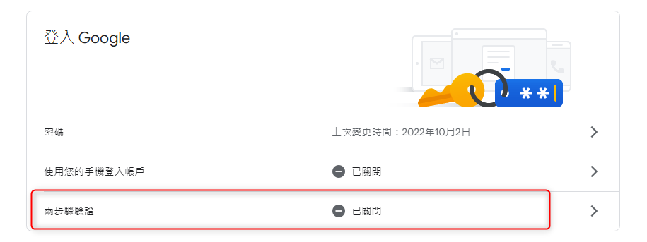
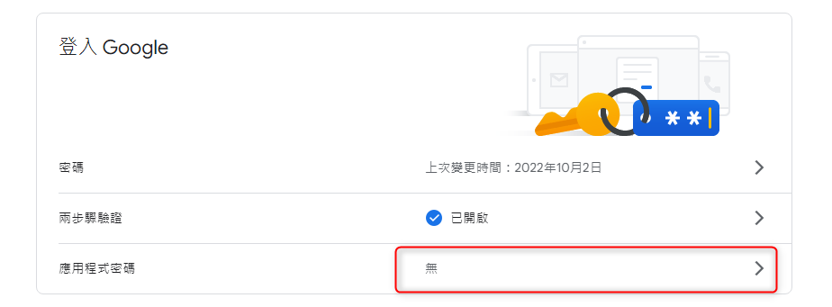
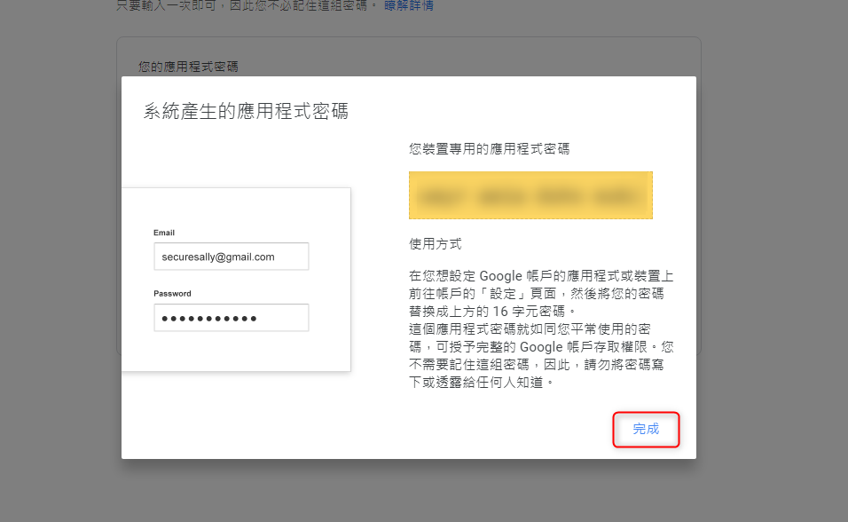

+++
author = "Hugo Authors"
title = "GCP-google 啟用兩步驟驗證 再設定應用程式專用密碼"
date = "2022-12-06"
#description = ""
categories = [
    "GCP"
]
tags = [
    "GCP",
]
image = "100.png"
+++

點選右上角頭像，管理你的帳戶
左邊 安全性 找到 "登入 Google" 並點選 "兩步驟驗證"

會列出有綁帳號的手機，點選繼續
接著輸入 "驗證碼"

都完成後退出到首頁，並點選 "應用程式密碼"

接著系統會產生一組隨機密碼
這組應用程式專用密碼只能登入一個地方

   

***




