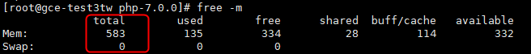
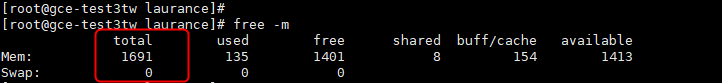

+++
author = "Hugo Authors"
title = "GCE-內存過小導致無法編譯PHP"
date = "2022-12-06"
#description = ""
categories = [
    "GCP"
]
tags = [
    "GCP",
]
image = "100.png"
+++

# 編譯PHP時,秀 ERROR: virtual memory exhausted: Cannot allocate memory

[因為用的是免費方案,內存小的可憐,故先調大再縮小]

GCP後台查看機器內存只有 614M

   
   
機器上看也是 583M

   
   
先將機器關機 (要關機才能調)

    init 0
    
到GCP後台調成 g1-small

   
   
開機後就能看到已調成 1.6G

   
***




