+++
author = "Hugo Authors"
title = "GCP-無痛轉移帳單免費額度"
date = "2022-02-16"
description = "{無限試用期教學}"
categories = [
    "GCP"
]
tags = [
    "GCP",
]
image = "100.png"
+++

# GCP 剩餘時間

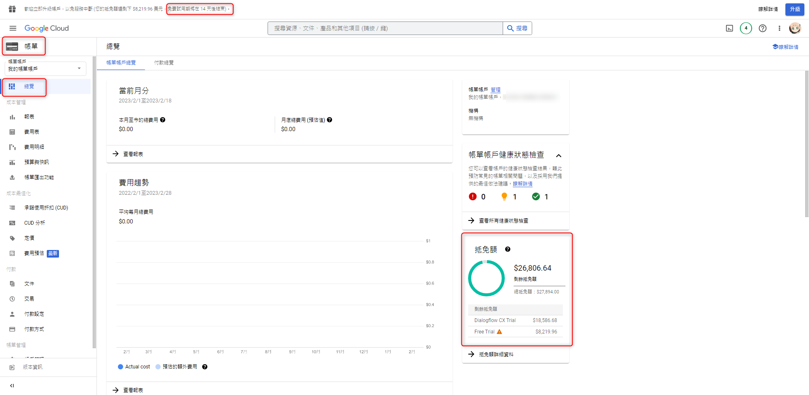

**在 [帳單 > 帳戶管理] 可以看到有帳單帳戶管理員**

**我們可以先用新 email 註冊一個新 GCP**

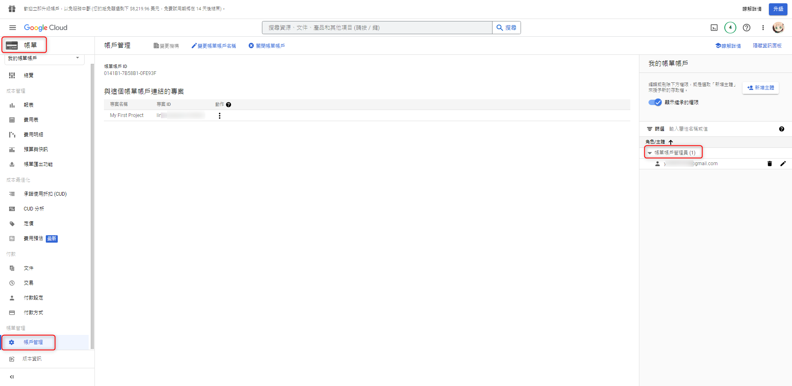

**建立一個新的 email 並綁定同一張信用卡,領取300美抵免額**

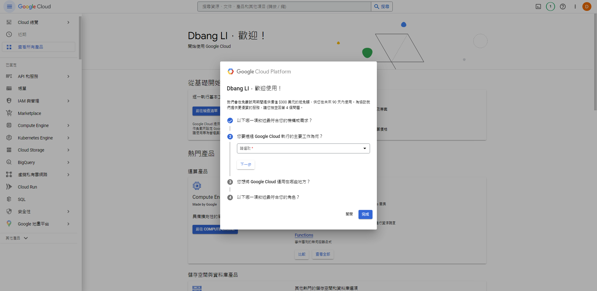

**ps. 這時會出現卡`被扣40塊`,`放心後面會退刷的`**

**在`舊 GCP帳號`裡新增剛剛新創立的`新 GCP帳號`**

    帳單 > 帳戶管理 > 新增主體
    
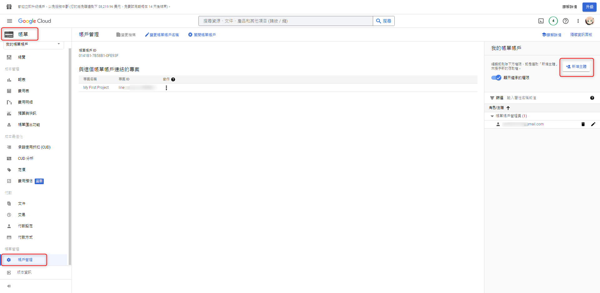

**將`新的 gmail`填入並選擇`帳單帳戶管理員`**

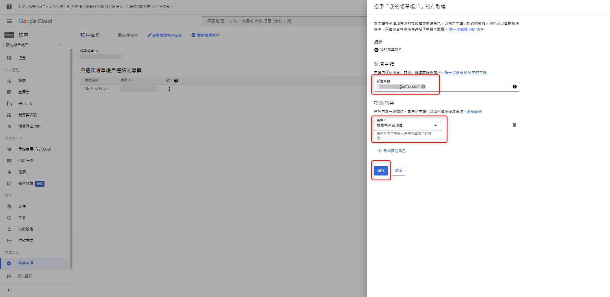

**儲存後可以看到帳單帳戶管理員多了 `新的GCP帳號`**

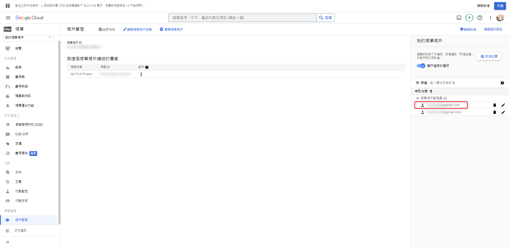

**接著到新的GCP帳號選擇`管理帳單帳戶`**

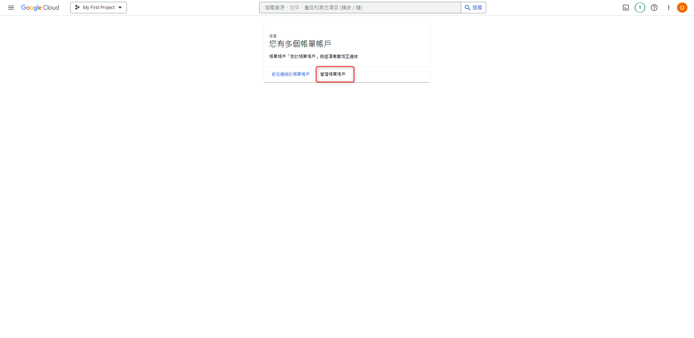

**在`新 GCP帳號`裡新增`舊 GCP帳號`**

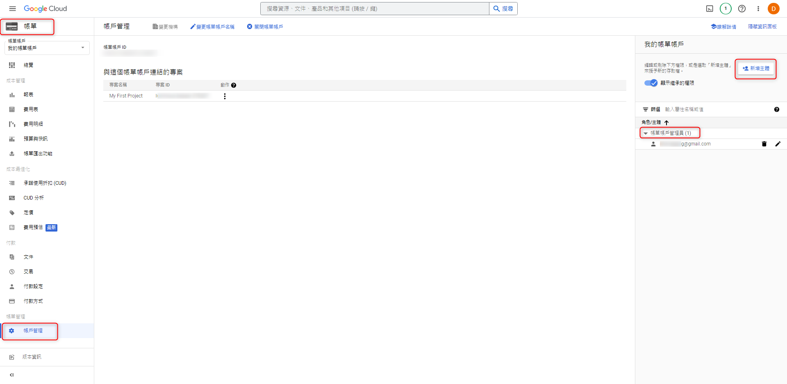

**將`舊的 gmail`填入並選擇`帳單帳戶管理員`**

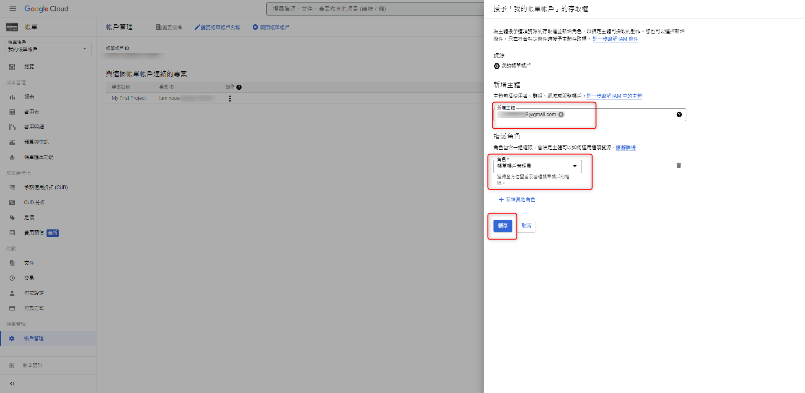

**儲存後可以看到帳單帳戶管理員多了 `舊的GCP帳號`**

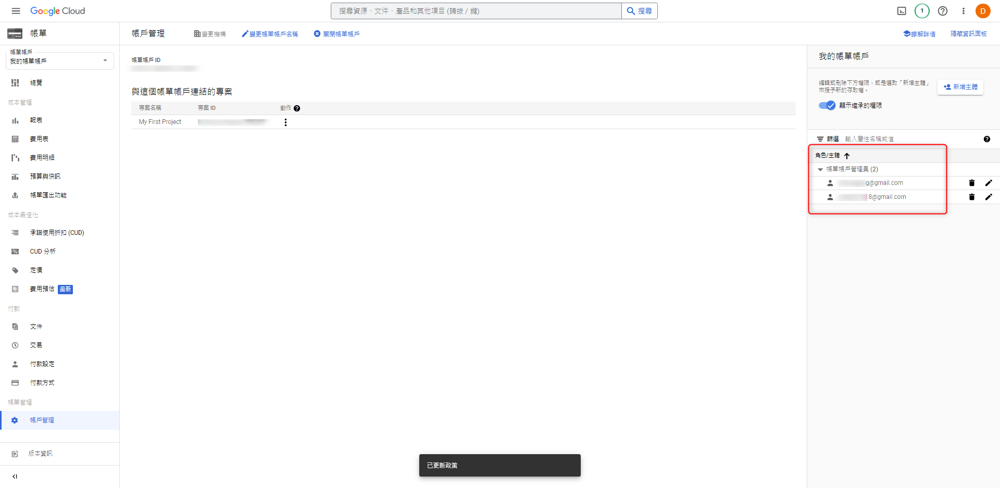

**重新開啟後可以看到舊帳號已延續新帳號的抵免額及天數**

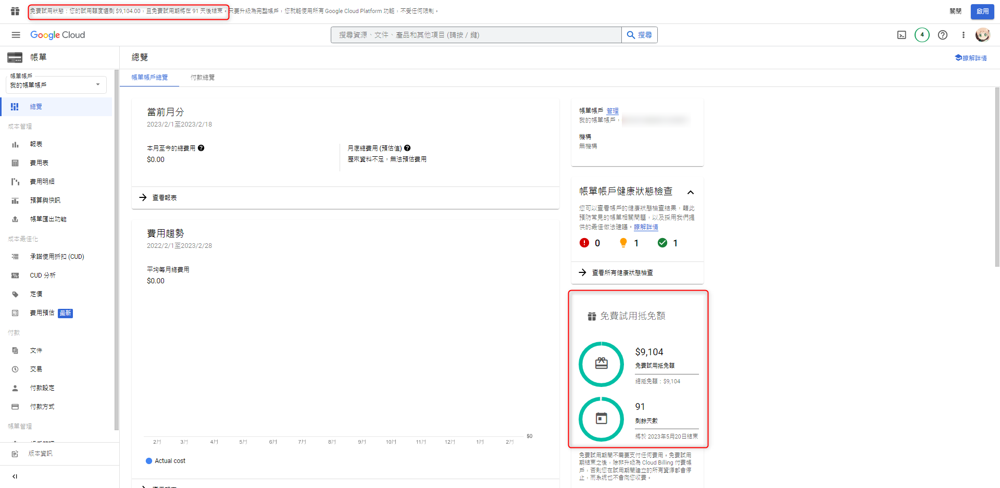

# 最後一步: 
# 將舊帳號GCP裡面`保留新帳號的帳單`  (將舊的gmail砍掉)
# 從新帳號GCP裡面`保留舊帳號的帳單` (將新的gmail砍掉)

# 新的GCP沒有跑機器,不會產生費用
# 用新的抵免額延續舊帳號裡的機器

***




