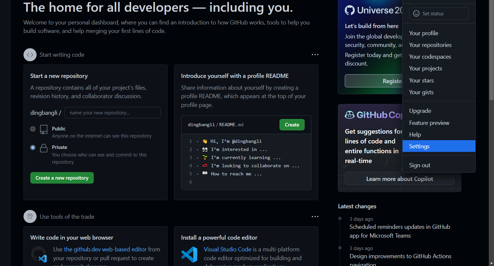
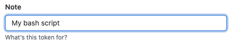
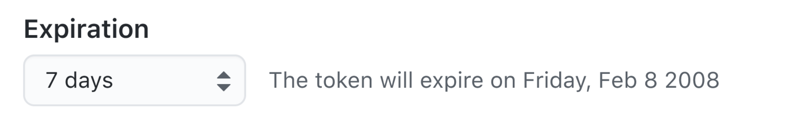

+++
author = "Hugo Authors"
title = "Git-建立訪問Token"
date = "2022-10-17"
description = "密碼登入顯示 Authentication failed"
categories = [
    "GIT"
]
tags = [
    "GIT",
]
image = "100.png"
+++

    點擊右上角 setting
    
   
   
    左側欄 點擊 Developer settings
    
   
   
    左側欄 點擊 Personal access tokens
    
   

    生成新 Tokens
    
   
   
    新增 Token Name
    
   
   
    選擇過期時間
    
   
   
    選擇鑰給予 Token 的權限
    
   
   
    生成 Tokens
    
   
   

***




