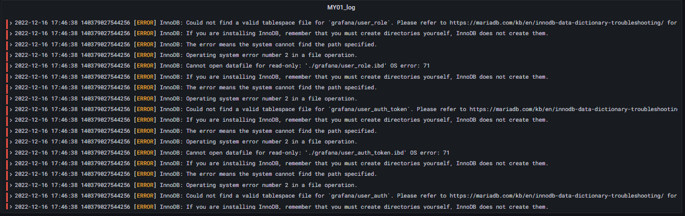

+++
author = "Hugo Authors"
title = "Grafana-Loki 查詢語言 LogQL"
date = "2022-12-16"
#description = "(建立agent監控並使用Line-Notify提醒)"
categories = [
    "Grafana",
    "Promtail",
    "Loki"
]
tags = [
    "Grafana",
    "Promtail",
    "Loki"
]
image = "100.png"
+++

   查詢關鍵字 "ERROR"
   
    {job="my1log",filename="/var/lib/mysql/master01/mysql.err"} |= "ERROR"

   
   
***




