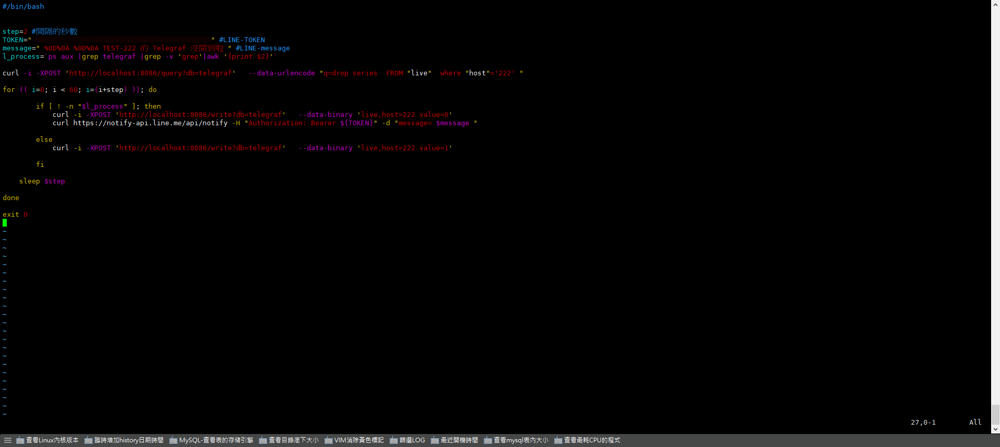
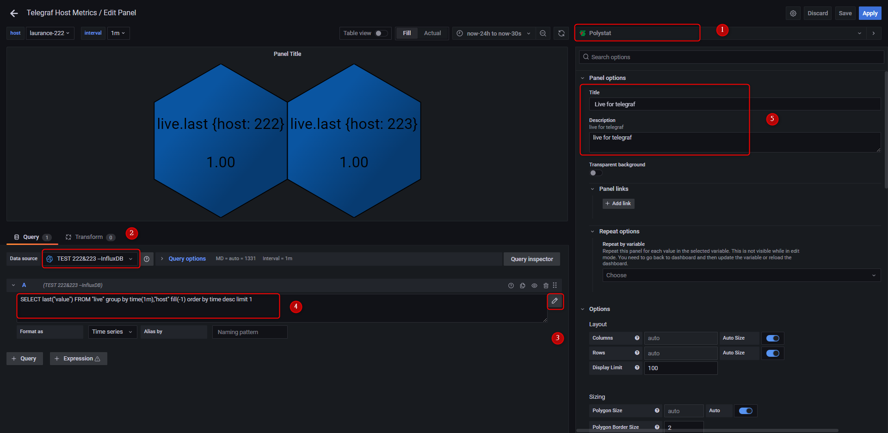
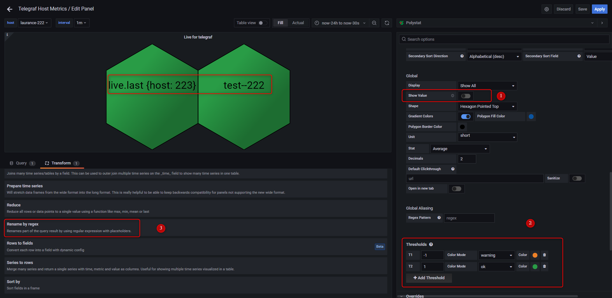
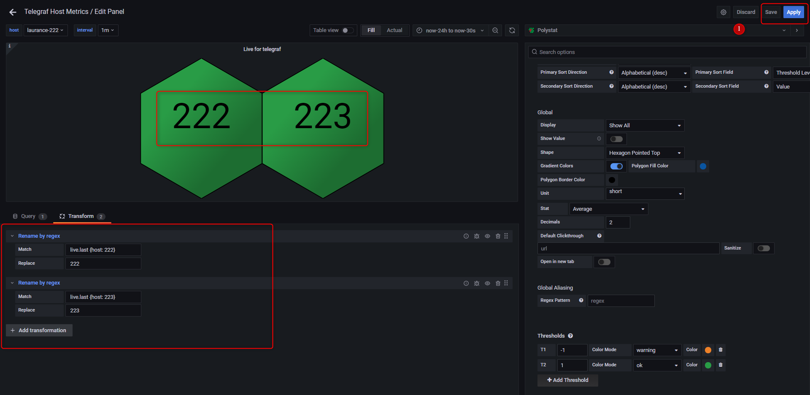

+++
author = "Hugo Authors"
title = "Grafana-Polystat panel使用"
date = "2022-11-03"
description = "(建立agent監控並使用Line-Notify提醒)"
categories = [
    "Grafana",
    "influxdb",
    "telegraf"
]
tags = [
    "Grafana",
    "influxdb",
    "telegraf"
]
image = "100.png"
+++

   **安裝Grafana套件**
    
    grafana-cli plugins install grafana-polystat-panel
    
   **服務重啟**
   
    service grafana-server restart
    
   **查看telegraf的PID**
   
    ps aux |grep telegraf |grep -v 'grep'|awk '{print $2}'
    
   **建立監控並寫入InfluDB的 Shell，並給予權限**
   
    vim live.sh && chmod 755 live.sh

   
   
   **建立排程 (SHELL:每2秒執行一次)**
   
    crontab -e
    
    * * * * * sh /home/grafana/crontab-live.sh
    
   **Grafana後台-建立新panel並設置**
   
   
   
   
   
   **最後記得要SAVE，不然得重頭在來**
   
   
   
   
   
   
   
***




