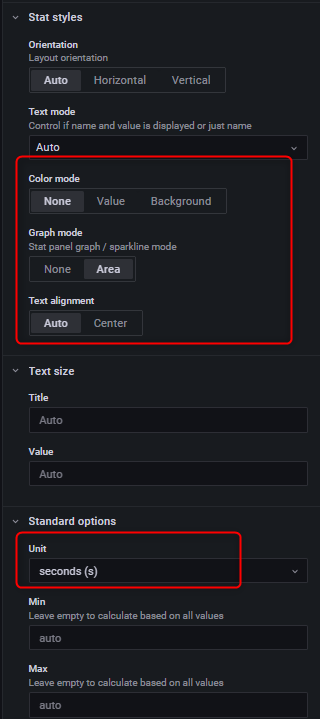

+++
author = "Hugo Authors"
title = "Grafana-使用uptime查詢系統運行時間"
date = "2022-12-16"
#description = ""
categories = [
    "Grafana"
]
tags = [
    "Grafana"
]
image = "100.png"
+++

# 建立 `panel for uptime`

點選 `uptime` 的 `panel` 選擇 `edit`

 

旁邊細節設定可參照 :

 
 
 

# InfluxDB查詢語法:

    select last(uptime_format) as value from system
    
    SELECT last("uptime_format") AS "value" FROM "system" WHERE "host" =~ /$server$/ AND $timeFilter GROUP BY time($interval)

***




