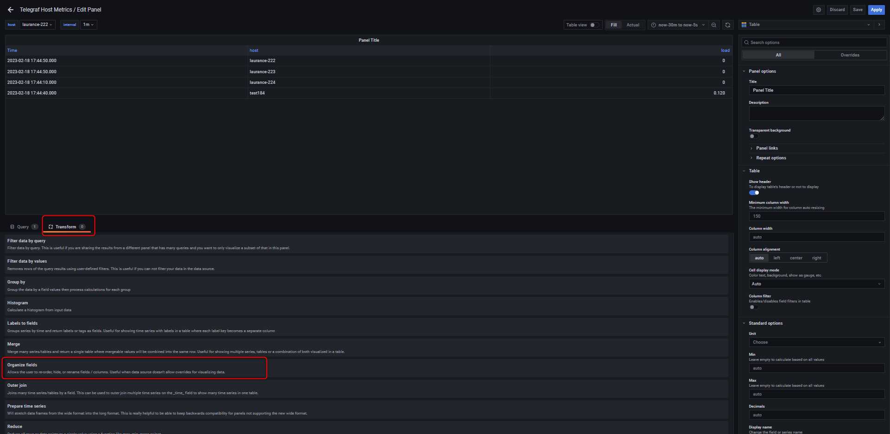
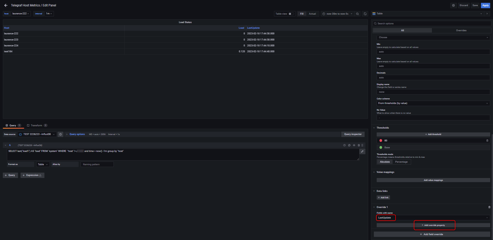
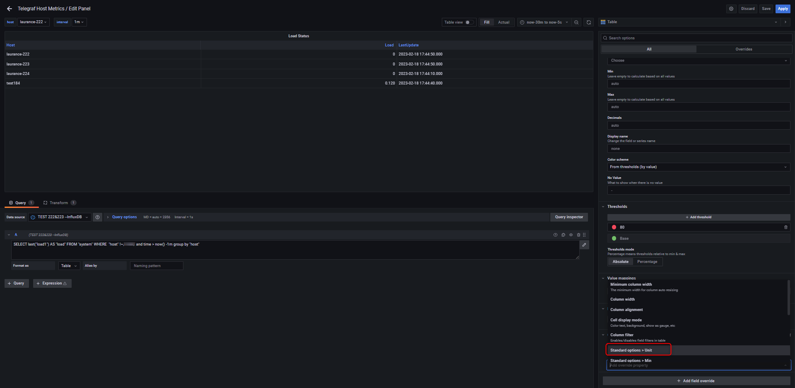
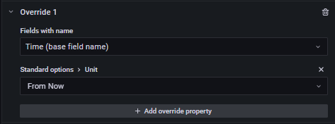
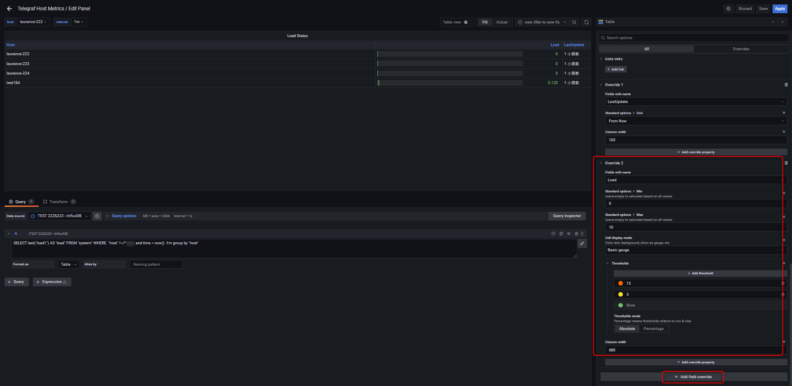

+++
author = "Hugo Authors"
title = "Grafana-建立 panel for loading"
date = "2022-12-16"
#description = ""
categories = [
    "Grafana"
]
tags = [
    "Grafana"
]
image = "100.png"
+++

# Add an panel for monitor loading

{step1} 右上角 `+` > Add an empty panel

{step2} 依需求填寫 `Data source` `Query` `Visualization`

    Data source 
    
    >> InfluxDB:databases
---    
    Query 
    
    >> SELECT last("load1") AS "load" FROM "system" WHERE  "host" !~/^$interval$/ and time > now() -1m group by "host"
---    
    Visualization 
    
    >> Table
    

{step3} 選擇 `Transform` 建立 `Organize fields` && 增加 `host` `load` `time`

{step4} 右側條件選單拉到最底選擇 

`Add filed override` > `Fields with name` > `LastUpdate` > `+ Add override property`

   
`Standard options > Unit` > `Date&time` > `From Now`

# Override 1

# Override 2

# Override 3

# Final

***




