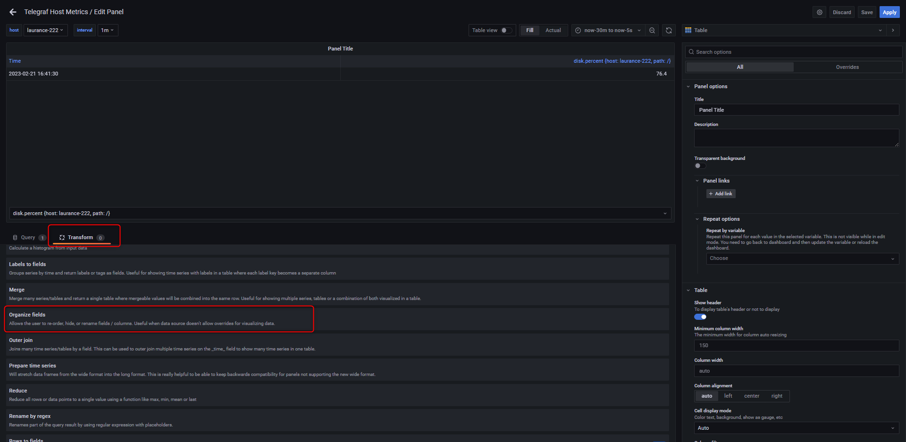
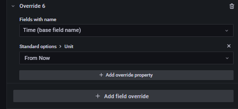

+++
author = "Hugo Authors"
title = "Grafana-建立 panel for storage"
date = "2022-12-16"
#description = ""
categories = [
    "Grafana"
]
tags = [
    "Grafana"
]
image = "100.png"
+++

# Add an panel for monitor storage

{step1} 右上角 `+` > Add an empty panel

{step2} 依需求填寫 `Data source` `Query` `Visualization`

    Data source > InfluxDB:databases
    
    Query > SELECT last("used_percent") AS "percent", "used" AS "used", "total" AS "total" FROM "disk" WHERE  "host" !~ /^$interval$/ and time > now() -1m group by "host", "path"
    
    Format as > Table
    
    Visualization > Table
    

{step3} 選擇 `Transform` 建立 `Organize fields` && 依需求填寫 `host`,`path`,`used`,`total`,`percent`,`lastupdate`

{step4} 右側條件選單拉到最底選擇 `Add filed override`

# Override 1 & Override 2

# Override 3 & Override 4

# Override 5 & Override 6

# FINAL

***




