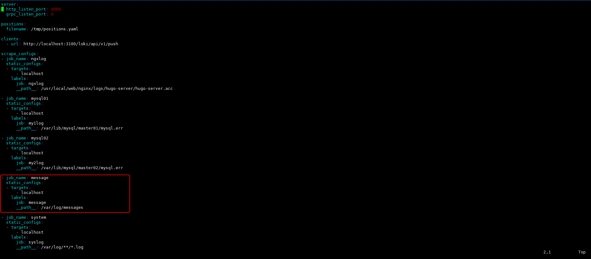
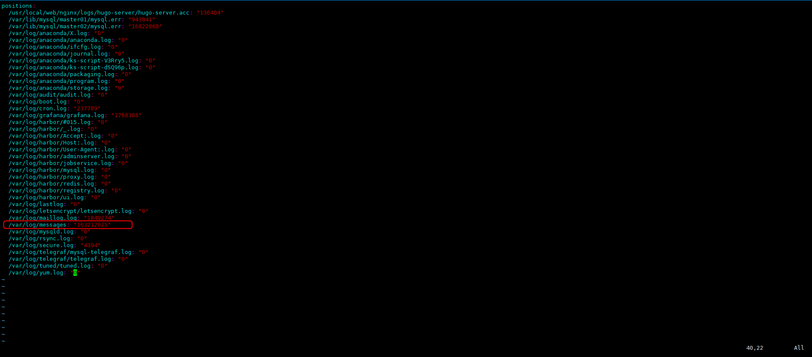
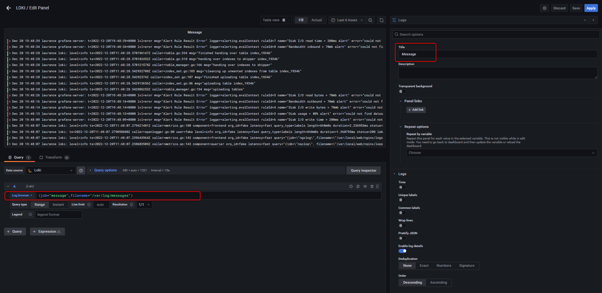
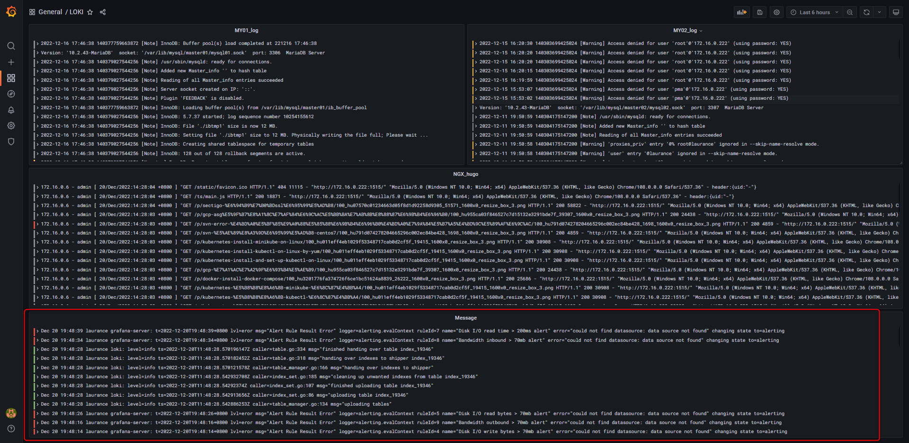
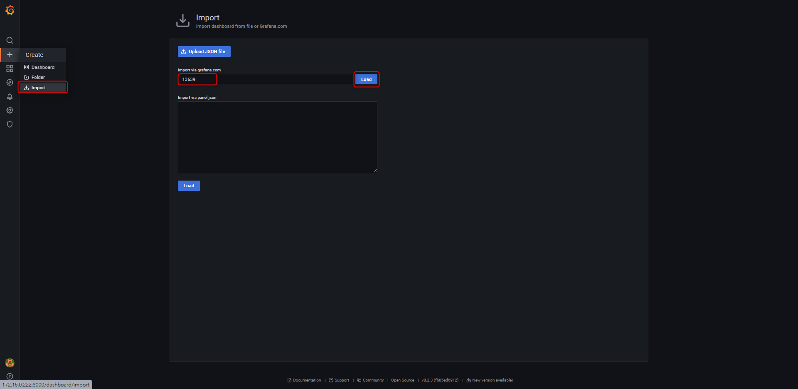
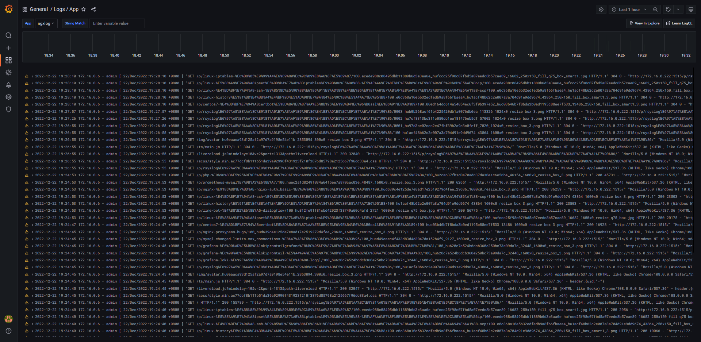

+++
author = "Hugo Authors"
title = "Grafana-搭建Loki、Promtail 多套即時性日誌"
date = "2022-12-16"
#description = "(建立agent監控並使用Line-Notify提醒)"
categories = [
    "Grafana",
    "Promtail",
    "Loki"
]
tags = [
    "Grafana",
    "Promtail",
    "Loki"
]
image = "100.png"
+++

   修改 Promtail 設定檔配置
   
    vim /etc/promtail/config.yml
    
   
   
   重啟服務
   
    systemctl restart promtail
    
   查看 tmp 下 positions 有沒有寫進去
   
    vim /tmp/positions.yaml
    
   
   
   修改 grafana 後台 panel 設置
   
    {job="message",filename="/var/log/messages"}
    
   
   
   成果 :
   
   
   
  ##套用模板##
  
  Grafana 後台點選 import (ID: 13639)
  
  
    
   成果 :
   
   

   
   
***




