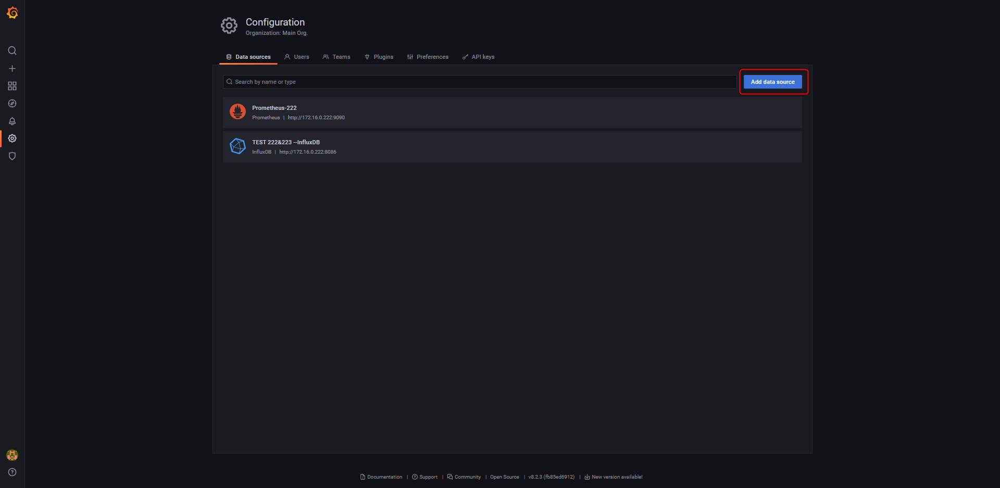
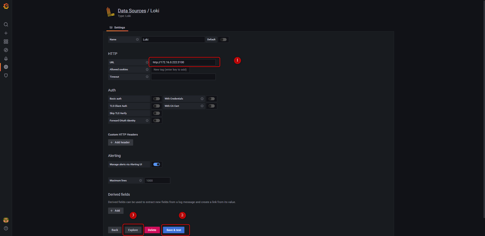

+++
author = "Hugo Authors"
title = "Grafana-搭建Loki、Promtail、Grafana輕量級日誌系統"
date = "2022-12-16"
#description = "(建立agent監控並使用Line-Notify提醒)"
categories = [
    "Grafana",
    "Promtail",
    "Loki"
]
tags = [
    "Grafana",
    "Promtail",
    "Loki"
]
image = "100.png"
+++

下載安裝啟動 [Grafana 官方載點](https://grafana.com/grafana/download)

    wget https://dl.grafana.com/enterprise/release/grafana-enterprise-9.3.2-1.x86_64.rpm
    
    yum localinstall grafana-enterprise-9.3.2-1.x86_64.rpm
    
    systemctl start grafana-server && systemctl status grafana-server
    
下載安裝啟動 [Promtail & Loki 官方載點](https://grafana.com/docs/loki/latest/installation/local/)

   PROMTAIL :
   
    wget https://github.com/grafana/loki/releases/download/v2.7.1/promtail-2.7.1.x86_64.rpm
    
    yum localinstall promtail-2.7.1.x86_64.rpm
        
   LOKI :
    
    wget https://github.com/grafana/loki/releases/download/v2.7.1/loki-2.7.1.x86_64.rpm
        
    yum localinstall loki-2.7.1.x86_64.rpm
    
   設定檔配置: 
   
   vim /etc/loki/config.yml
   
   
   
   vim /etc/promtail/config.yml
   
   
   
    systemctl start loki && systemctl start promtail
    
   訪問 GRAFANA :
   
   建立 Datasorce for loki
   
   
   
   選擇 LOKI - Database
   
   
   
   填寫資料來源 之後按 save && explore
   
   
   
   填寫 Log browser job & filename 即可
   
   
   
   驗證:
   
    curl http://172.16.0.222:3100/metrics
   
   
   ***Loki 整體架構***
   
   
   
   
    

   
   
***




