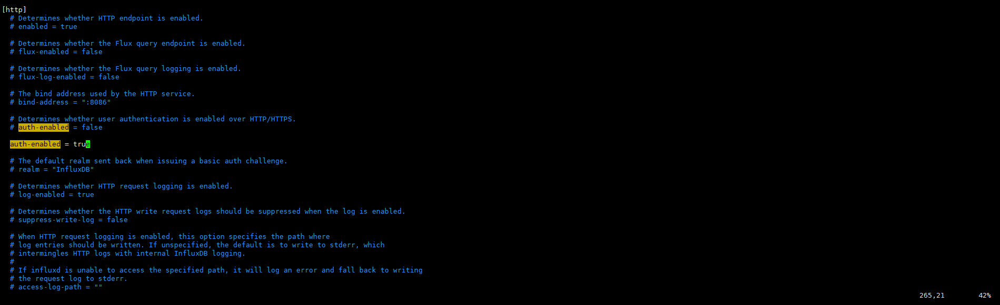

+++
author = "Hugo Authors"
title = "InfluxDB-建立使用者密碼及權限"
date = "2023-03-23"
#description = ""
categories = [
    "Database"
]
tags = [
    "InfluxDB",
]
image = "100.jpg"
+++


InfluxDB 預設是沒有密碼的,使用 `influx` 進入介面操作即可

    [root@laurance ~]# influx
    
    Connected to http://localhost:8086 version 1.8.10
    
    InfluxDB shell version: 1.8.10
    
    > 
    
    > 

建立使用者及密碼

```javascript
CREATE USER telegraf WITH PASSWORD 'telegraf'

CREATE USER <username> WITH PASSWORD '<password>'

```

給予讀的權限

```javascript
GRANT READ ON telegraf TO laurance

GRANT [READ,WRITE,ALL] ON <database_name> TO <username>
```

查看使用者

```javascript
SHOW USERS

```

查看權限

```javascript
SHOW GRANTS FOR laurance

```

拔除 `root` 權限

```javascript
REVOKE ALL PRIVILEGES FROM telegraf

```

給予 `root` 權限

```javascript
GRANT ALL PRIVILEGES TO laurance

```

重新設置密碼

```javascript
SET PASSWORD FOR laurance = 'influxdb4ever'

```

刪除使用者

```javascript
DROP USER laurance

```

# 將密碼驗證打開 (ps 一定要有 ''ROOT'  才能登入)

編輯設定檔 `vim /etc/influxdb/influxdb.conf`

將 `[http] 模快下的 [auth-enabled] 改為 true`

 
 
改完設定重啟 DB

```javascript
systemctl restart influxdb

```

帶密碼登入

```javascript
influx -username laurance -password influxdb4ever

```

進入介面登入

    [root@laurance ~]# influx
    
    Connected to http://localhost:8086 version 1.8.10
    
    InfluxDB shell version: 1.8.10
    
    > auth
    
    username: laurance
    
    password: 
    
    > 


***


<style>
.emojify {
	font-family: Apple Color Emoji, Segoe UI Emoji, NotoColorEmoji, Segoe UI Symbol, Android Emoji, EmojiSymbols;
	font-size: 2rem;
	vertical-align: middle;
}
@media screen and (max-width:650px) {
  .nowrap {
    display: block;
    margin: 25px 0;
  }
}
</style>

