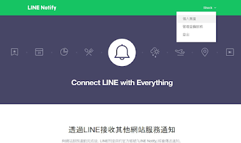
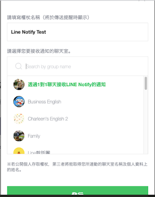
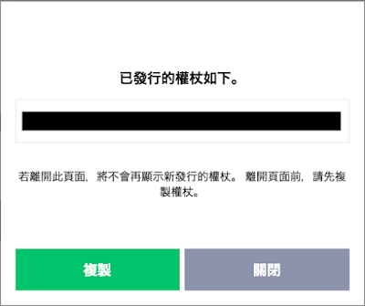
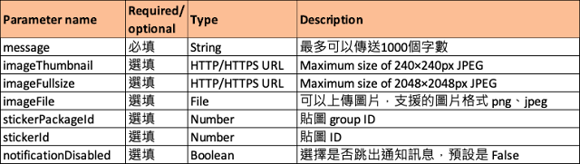

+++
author = "Hugo Authors"
title = "LINE Notify"
date = "2022-11-10"
#description = ""
#categories = [
#    ""
#]
#tags = [
#]
image = "100.jpg"
+++
    

   登入 [LINE Notify](https://notify-bot.line.me/zh_TW/)
   
   
   
   選擇要接收通知的聊天室
   
   
   
   把產生的權證記錄下來
   
   
   
   ***API***
   
   
   
   
   [參考](https://shockuccu.blogspot.com/2021/10/postman.html)

***




