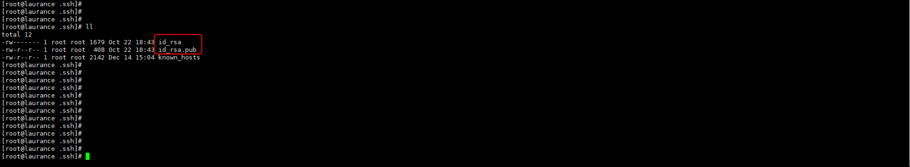
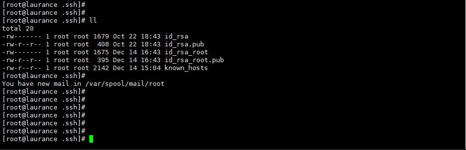

+++
author = "Hugo Authors"
title = "Linux-使用 SSH 配合憑證來遠端複製檔案 (scp)"
date = "2022-12-10"
#description = ""
categories = [
    "Linux"
]
tags = [
    "Linux",
]
image = "100.png"
+++

   來源 A機建立公鑰及私鑰
    
    ssh-keygen -t dsa
    
   到家目錄的 .ssh裡面看，會多出 id_rsa 和 id_rsa.pub 這兩個檔案
   
   

   將 id_dsa.pub 的內容複製到 目的B機 並命名為 authorized_keys - 限制600權限
   
    cat id_rsa.pub (A機) > authorized_keys (B機)
    
    chmod 600 authorized_keys
   
   驗證測試
   
    來源到目的使用 ssh , scp 免密碼
    
   PS. 若是有多個  id_rsa.pub 需要設定 (注意!!! 需要在第一步選擇路徑)
   
    ssh-keygen -t rsa
    
   第一步需填寫路徑 其餘 ENTER 即可
    
    Enter file in which to save the key (/root/.ssh/id_rsa): /root/.ssh/id_rsa_root
    
   
    

   

***




