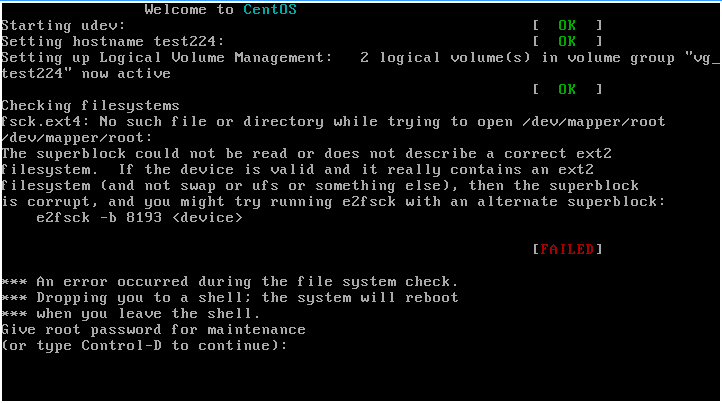
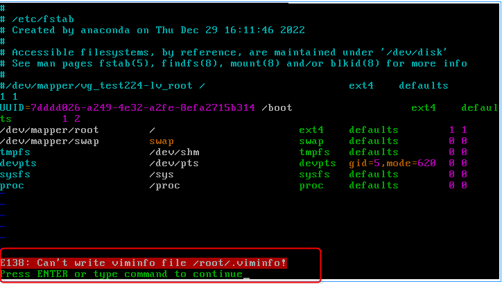
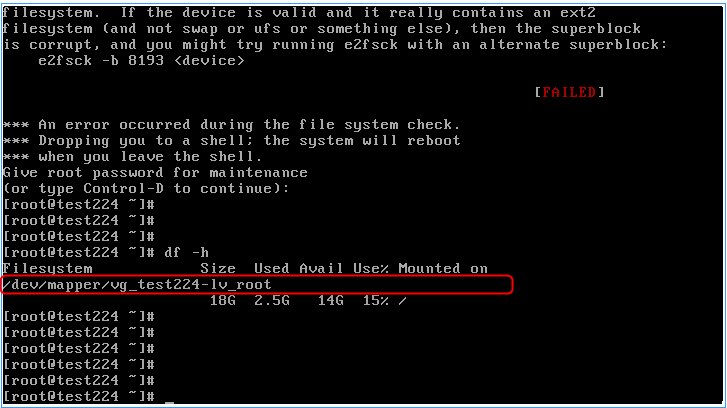
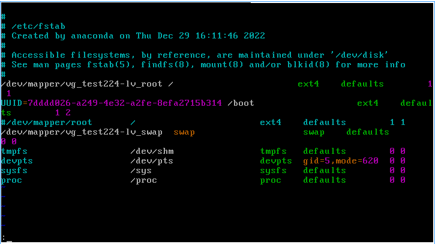

+++
author = "Hugo Authors"
title = "Linux-開機出現 (or type control -D to continue) 解決辦法"
date = "2023-02-01"
#description = ""
categories = [
    "Mount"
]
tags = [
    "Linux",
]
image = "100.png"
+++

# Linux 開機失敗 ERROR "or type control -D to continue" 解決辦法

主要是磁碟問題,秀的 ERROR

先使用 `root` 進入 `修復模式`

輸入完密碼後,進入的模式為 `唯讀模式` 使用以下指令更改為 `讀寫模式`

    mount -n -o remount,rw /

這邊使用指令 `df -h` 可以看到原本磁碟 mount 的位置

將正確位置寫入 `/etc/fstab` 

重啟後即可

    reboot

***




