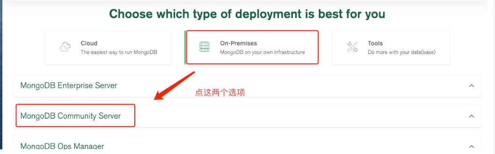

+++
author = "Hugo Authors"
title = "Mongodb-安裝教學"
date = "2022-08-15"
#description = ""
categories = [
    "Database"
]
tags = [
    "Mongodb",
]
image = "100.png"
+++

    
   [MongoDB官網下載地址](https://www.mongodb.com/download-center#community)
    
   
   
   
   
      
    yum install libcurl openssl
    wget https://fastdl.mongodb.org/linux/mongodb-linux-x86_64-4.0.28.tgz
    tar zxvf mongodb-linux-x86_64-4.0.28.tgz  -C /usr/local/
    mv /usr/local/mongodb-linux-x86_64-4.0.28/ mongodb/
    cd /usr/local/mongodb/
    mkdir data log conf
    cd data/ && mkdir db/
    cd /usr/local/mongodb/conf && touch mongodb.conf
    
    
    vim mongodb.conf
    
    dbpath=/usr/local/mongodb/data/db  
    logpath=/usr/local/mongodb/log/mongodb.log 
    port=27017
    fork=true
    bind_ip=0.0.0.0
    
    cd ..
    
    ./bin/mongod --config ./conf/mongodb.conf               //啟動服務
    ./bin/mongod --config ./conf/mongodb.conf --shutdown    //關閉服務
    ./mongo		                                        //連線mongodb
    
    
    

***




