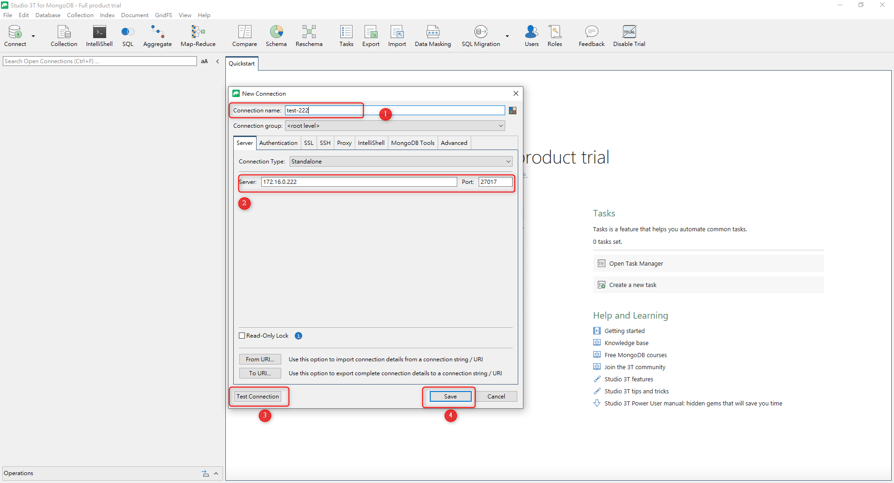

+++
author = "Hugo Authors"
title = "Mongod-如何使用studio 3T遠端建立連線"
date = "2022-10-22"
#description = ""
categories = [
    "Database"
]
tags = [
    "Mongodb",
]
image = "100.png"
+++

    新建立連線
    
   
   
    打上 host , port 儲存
    
   
    

[studio 3T for windows](https://studio3t.com/download/)

***




