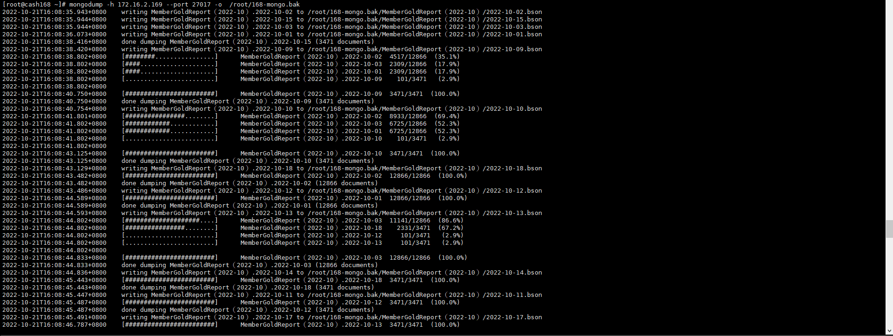
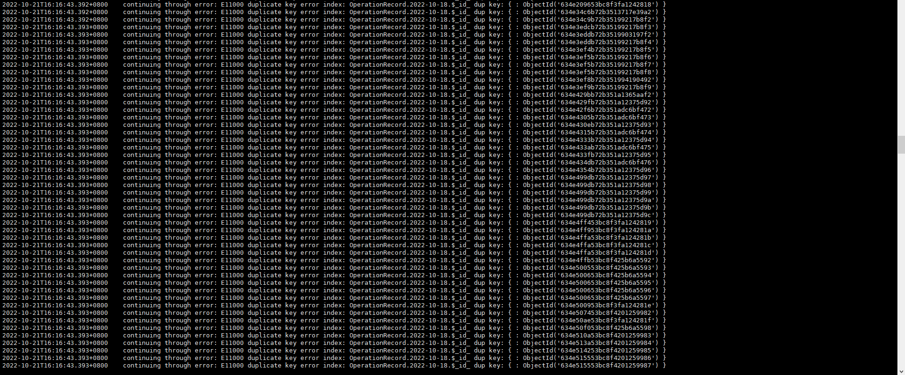

+++
author = "Hugo Authors"
title = "Mongod-如何備份與還原 MongoDB"
date = "2022-10-22"
#description = ""
categories = [
    "Database"
]
tags = [
    "Mongodb",
]
image = "100.png"
+++

   **先建立要備份的資料庫 (否則會備份失敗)**
   
   mkdir /root/168-mongo.bak
    
   **透過以下命令進行單個資料庫備份 (參數 -d 資料庫)**
   
    mongodump -h 172.16.2.169 --port 27017 -d my-mongo -o ./root/168-mongo.bak
    
   **透過以下命令進行全部資料庫備份**
   
    mongodump -h 172.16.2.169 --port 27017 -o ./root/168-mongo.bak
    
   **透過以下命令進行本機備份 (解決Authentication failed.)**
   
    mongodump -o mongodb-dump/
    
   
   
   **透過以下命令還原剛剛備份的資料庫**
   
    mongorestore -h 127.0.0.1 --port 27017 /root/168-mongo.bak
           
   **會報錯 ERROR - E11000 duplicate key error 重複密鑰錯誤集合**
   
   
   
    (加入參數 --drop my-backup)  注意!!! 任何不在備份中的文件都將永久丟失！
   
    mongorestore -h 127.0.0.1 --port 27017 /root/168-mongo.bak --drop
    

***




