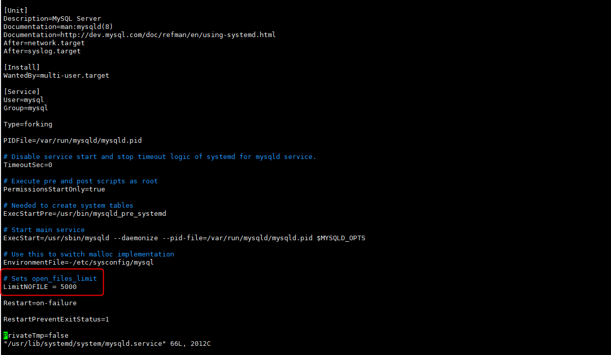

+++
author = "Hugo Authors"
title = "MySQL-Changed limits max_connections 解决方法"
date = "2022-12-14"
#description = ""
categories = [
    "Database"
]
tags = [
    "MySQL",
]
image = "100.png"
+++

***修改系統 Kernel 的變數***

    vim /etc/sysctl.conf
    
    net.ipv4.tcp_syncookies = 1
    net.ipv4.tcp_tw_reuse = 1
    net.ipv4.tcp_tw_recycle = 1
    net.ipv4.tcp_fin_timeout = 30
    
***修改系統資源限制配置文件***

    vim /etc/security/limits.conf 
    
    * soft nproc 65535
    * hard nproc 65535
    * soft nofile 65535
    * hard nofile 65535  
    
***將mysql默認資源限制拉高 (默認為5000)***

    vim /usr/lib/systemd/system/mysqld.service
    
    LimitNOFILE=65535
    
   

***




