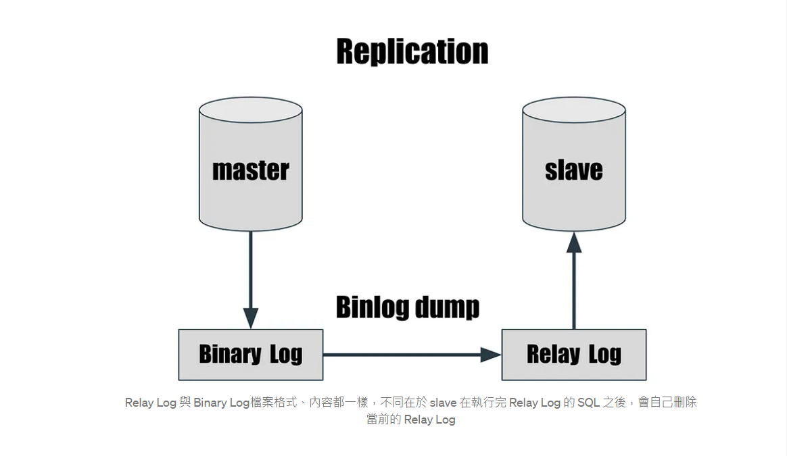

+++
author = "Hugo Authors"
title = "MariaDB-Replication 主從式跟隨架構設定"
date = "2022-08-03"
#description = ""
categories = [
    "Database"
]
tags = [
    "MySQL",
]
image = "100.png"
+++

# Master Slave Replication 的架構

在 master 的 server 執行的 SQL command 會被記錄在 Binary Log 裡面

master 將 Binary Log 傳送到 slave 的 Relay Log

slave 依據 Relay Log 做資料的變更



# 建立 MySQL Replication 實作紀錄 [ Slave 設定為不寫 binlog]

# Master server 設定 :

修改 Master 設定檔

    vim /etc/mysql/my.cnf
    
```mysql
[mysqld]
skip-external-locking
sql_mode=NO_AUTO_Create_USER,NO_ENGINE_SUBSTITUTION

#default-storage-engine=MYISAM
explicit_defaults_for_timestamp=true
#--------------------------------------
#default-tmp-storage-engine=MYISAM
character_set_server = utf8
innodb_buffer_pool_size = 1500M
innodb_log_buffer_size = 32M
innodb_log_file_size = 16M
innodb_flush_log_at_trx_commit = 2
innodb_buffer_pool_instances = 1
innodb_file_per_table=1
#-------------------------------------
max_connections = 2000
max_allowed_packet = 64M
table_open_cache = 512
sort_buffer_size = 4M
net_buffer_length = 8K
read_buffer_size = 256K
read_rnd_buffer_size = 512K
myisam_sort_buffer_size = 128M
#key_buffer = 256M
#-------------------------------------
socket = /var/lib/mysql/mysql.sock
pid-file = mysql.pid
log-error = mysql.err
log-slave-updates
max_binlog_size = 500M
binlog_format="MIXED"
log-bin = log-bin
server_id = 999

relay-log-purge = 1
max-relay-log-size = 500M
relay-log-space-limit = 500M
 
slow_query_log = 1
slow_query_log_file = slow-queries.log
long_query_time = 1
#---------------------------------------------
[mysqld_multi]
mysqld = /usr/bin/mysqld_safe
mysqladmin = /usr/bin/mysqladmin
```

重新啟動 MySQL 服務 [使設定檔生效]

    mysqladmin -uroot -p shutdown
    
    mysqld_safe &

登陸 Master 建立 Slave 帳號
    
    mysql -u root -p
    
```mysql
STOP SLAVE;
GRANT REPLICATION SLAVE ON *.* TO '輸入使用者名稱'@'輸入來源 + %' IDENTIFIED BY '輸入密碼';
FLUSH PRIVILEGES;
SHOW MASTER STATUS;
exit;
```

DUMP 語法
    
    mysqldump -uroot -p --all-databases > masterdatabase.sql
  
登陸 Master 查看 Master 資訊
    
    mysql -u root -p
    
```mysql
show master status;
exit;
```
    
將 SQL 檔 SCP 至 Slave
    
    scp masterdatabase.sql root@slave主機來源:~
    
# Slave server 設定 :

Slave 停 DB

    mysqladmin -uroot -p shutdown

將 Master 的 SQL 檔匯入 Slave

    mysql -u root -p < /home/masterdatabase.sql
   
修改 Slave 設定檔

    vim /etc/my.cnf
    
```mysql
[mysqld]
skip-external-locking
#skip-innodb
#skip-name-resolve
sql_mode=NO_AUTO_Create_USER,NO_ENGINE_SUBSTITUTION
server_id = 998

innodb_buffer_pool_size = 1500M
innodb_log_buffer_size = 32M
innodb_log_file_size = 16M
innodb_flush_log_at_trx_commit = 2
innodb_buffer_pool_instances = 1

#innodb_file_format = barracuda
#innodb_file_format_max = barracuda
innodb_file_per_table = 1

read-only = 1
#-------------------------------------
max_connections = 2000
max_allowed_packet = 64M
table_open_cache = 512
sort_buffer_size = 4M
net_buffer_length = 8K
read_buffer_size = 256K
read_rnd_buffer_size = 512K
myisam_sort_buffer_size = 128M
#key_buffer = 256M
#-------------------------------------
socket = /var/lib/mysql/mysql.sock
pid-file = mysql.pid
log-error = mysql.err
log-slave-updates
port = 3306
relay-log-purge = 1
max-relay-log-size = 500M
relay-log-space-limit = 500M
 
slow_query_log = 1
slow_query_log_file = slow-queries.log
#long_query_time = 1
#---------------------------------------------
[mysqld_multi]
mysqld = /usr/bin/mysqld_safe
mysqladmin = /usr/bin/mysqladmin
```
   
啟動 Slave DB

    mysqld_safe &
   
設定 SlaveDB，指定 Master DB 登入資訊，並啟動 Replication
    
    mysql -u root -p
    
```mysql
STOP SLAVE;
CHANGE MASTER TO MASTER_HOST='輸入Master主機ip', MASTER_USER='輸入使用者名稱', MASTER_PASSWORD='輸入密碼', MASTER_LOG_FILE='mariadb-bin.000001', MASTER_LOG_POS=479;
start slave;
SHOW SLAVE STATUS \G;
```

   ############################################


***


<style>
.emojify {
	font-family: Apple Color Emoji, Segoe UI Emoji, NotoColorEmoji, Segoe UI Symbol, Android Emoji, EmojiSymbols;
	font-size: 2rem;
	vertical-align: middle;
}
@media screen and (max-width:650px) {
  .nowrap {
    display: block;
    margin: 25px 0;
  }
}
</style>

