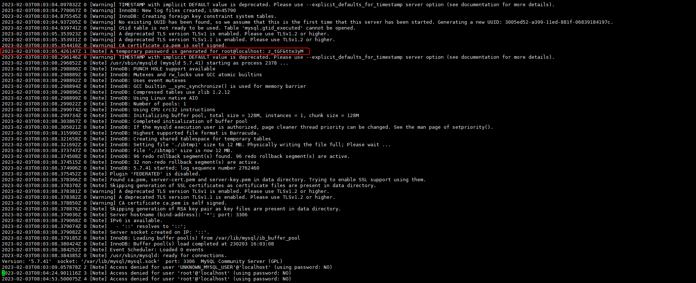

+++
author = "Hugo Authors"
title = "Mysql-5.7 剛載完的密碼存放位置"
date = "2022-09-27"
description = "[實測 mysql-5.7 會有隨機密碼, mariadb則預設沒密碼]"
categories = [
    "Database"
]
tags = [
    "MySQL",
]
image = "100.png"
+++

# 剛下載完啟動 server 會有隨機密碼

vim /var/log/mysqld.log

    
初次登入需要設置 root@localhost密碼 (規則為: 大英 + 小英 + 符號)

    SET Password = password('Aaa123456@');
    
    
***




