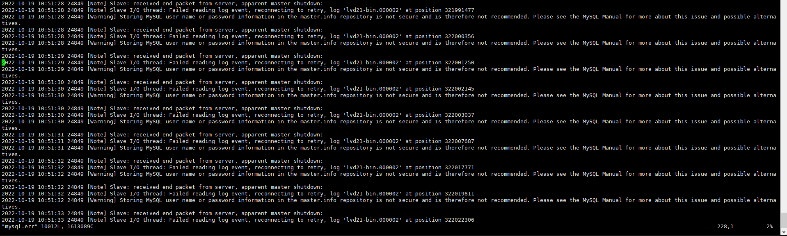

+++
author = "Hugo Authors"
title = "Mysql-報錯Slave received end packet from server apparent master shutdown"
date = "2022-10-19"
#description = ""
categories = [
    "Database"
]
tags = [
    "MySQL",
]
image = "100.png"
+++

   **MySQL 一臺從庫的錯誤日誌，大量報下面的錯誤資訊**
    
   
   
    檢查一下 ServerID 有沒有重複
    


show global variables like 'server%id%';


        
    若 ServerID 沒重複的話那肯定就是 DB 的 UUID 重複了
    
   **解決方式 :**
   
    到 MySQL 目錄將 auto.cnf 砍掉重新生成
    


cd /var/lib/mysql

rm -f auto.cnf

mysqld_multi stop 3

mysqld_multi start 3



***




