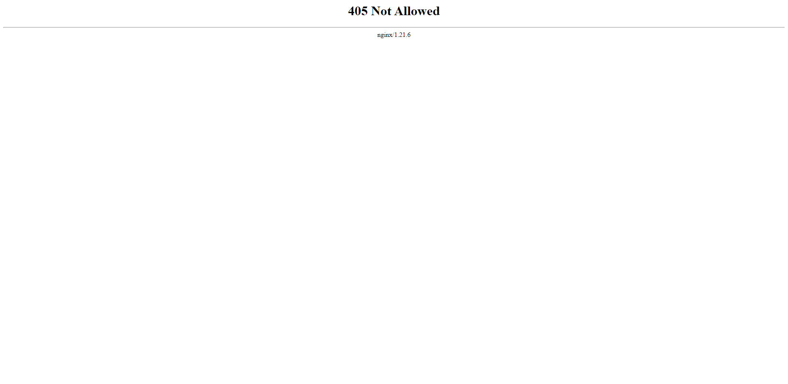

+++
author = "Hugo Authors"
title = "Nginx-405 Not Allowed"
date = "2023-01-29"
description = "跨域存取錯誤"
categories = [
    "Web"
]
tags = [
    "Nginx",
]
image = "100.png"
+++


# 跨域存取錯誤  405 : Not Allowed



解決方法 :

```javascript
  # To allow POST on static pages 允許靜態頁使用POST方法
  error_page  405     =200 $uri ;
```


***


<style>
.emojify {
	font-family: Apple Color Emoji, Segoe UI Emoji, NotoColorEmoji, Segoe UI Symbol, Android Emoji, EmojiSymbols;
	font-size: 2rem;
	vertical-align: middle;
}
@media screen and (max-width:650px) {
  .nowrap {
    display: block;
    margin: 25px 0;
  }
}
</style>

