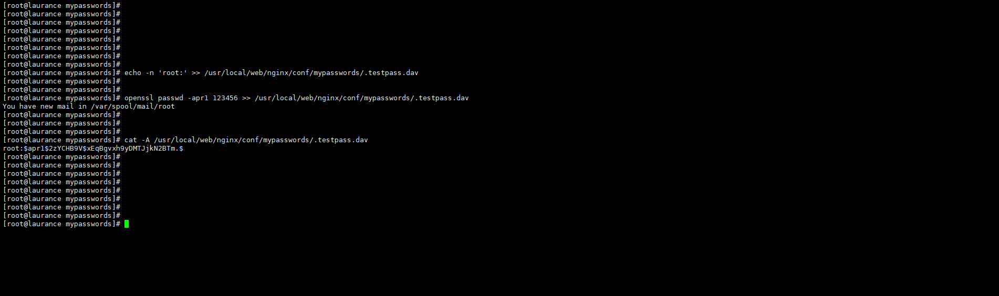
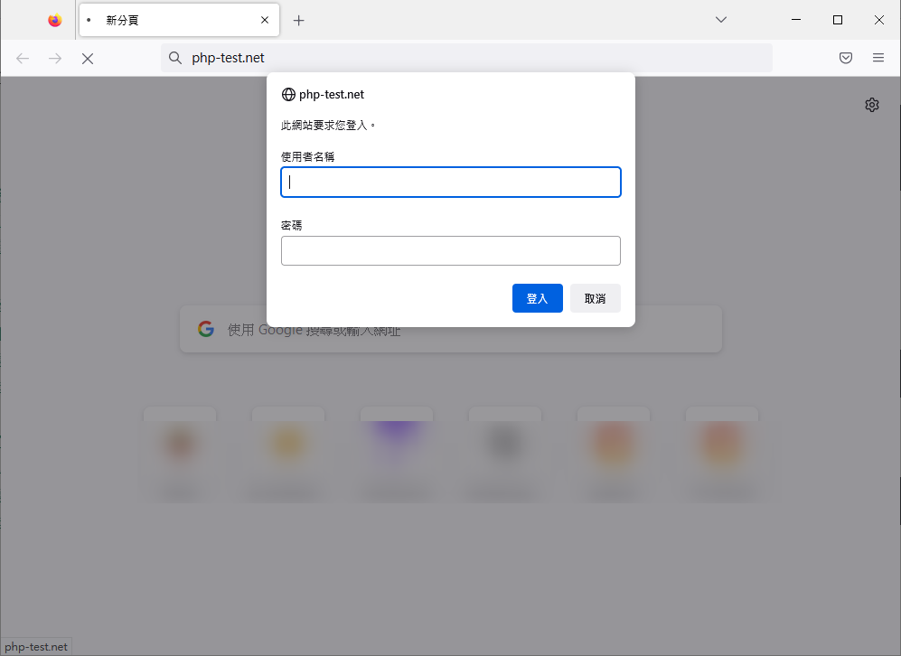

+++
author = "Hugo Authors"
title = "Nginx-配置 Nginx auth_basic 身分驗證"
date = "2022-12-10"
#description = ""
categories = [
    "Web"
]
tags = [
    "Nginx",
]
image = "100.png"
+++

   ***NGINX 默認就有安裝 ngx_http_auth_basic_module 模塊 (不用特別編譯)***
   
   生成帳號 && 密碼
   
    echo -n 'root:' >> /usr/local/web/nginx/conf/mypasswords/.testpass.dav
    
    openssl passwd -apr1 123456 >> /usr/local/web/nginx/conf/mypasswords/.testpass.dav
    
   
   
   配置 Nginx
   
    server {
    
            listen          80;
            server_name     php-test.net;
            index           index.php index.html;
            root            /home/test/php;
            include         vhost/file.conf;
            access_log      logs/test/test.acc access;
            auth_basic      "authentication";
            auth_basic_user_file /usr/local/web/nginx/conf/mypasswords/.testpass.dav;
    
    }
    
   file.conf (PHP)
   
    location ~ \.php$ {
            try_files $uri =404;
            fastcgi_split_path_info ^(.+\.php)(/.+)$;
            include fastcgi_params;
            #fastcgi_index index.php;
            fastcgi_param SCRIPT_FILENAME $document_root$fastcgi_script_name;
            #fastcgi_intercept_errors on;
            fastcgi_pass 127.0.0.1:9000;
        }
    
        location ~ \.wav$ {
            add_header Content-Disposition "inline";
        }
        
   NGINX 重啟
   
    /usr/local/web/nginx/sbin/nginx -t
    
    /usr/local/web/nginx/sbin/nginx -s reload
    
   驗證:  WINDOWS 本機綁 HOST 
   
    172.16.0.222 	php-test.net
    
   
    
   
   

***




