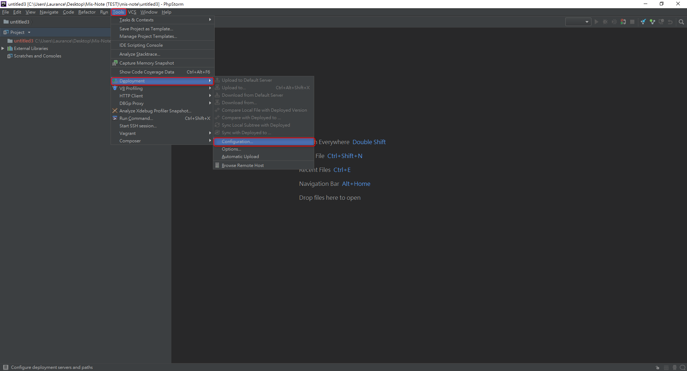

+++
author = "Hugo Authors"
title = "PHPstorm-IDEKEY 連接方式"
date = "2022-10-17"
#description = ""
categories = [
    "PHPstorm"
]
tags = [
    "PHPstorm",
]
image = "100.png"
+++

    1.	新增一個New Project
    
   
   
    2.	直接按下 Create >> Open in new window >> OK
    
   
   
    3.	打開遠端部署（Development）設定介面
    
   
   
    4.	按下 + >> Name >> Type: SFTP
    
   
   
    5.	測試IDE登入 再按Test SFTP connection 即可
    
            SFTP host: IP
            Port : 22
            Root path: /
            User name: jimide
            Auth type: OpenSSH or Putty
            Private key file: admin-jimide.pem

    
   
   
   

***




