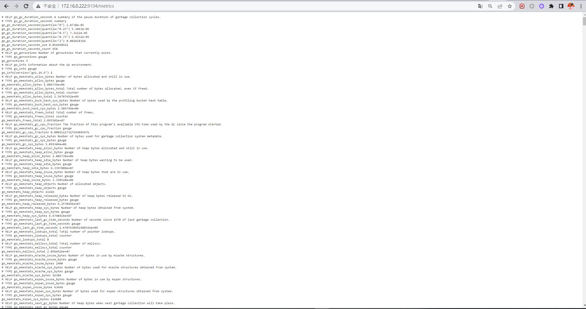

+++
author = "Hugo Authors"
title = "Prometheus MySQL監控"
date = "2022-12-06"
#description = ""
categories = [
    "Prometheus"
]
tags = [
    "Prometheus",
]
image = "100.png"
+++

    MySQL 建立 exporter帳號
    
   
   
   create user 'exporter'@'%' identified by 'exporter';
   GRANT REPLICATION CLIENT, PROCESS ON *.* TO 'exporter'@'%';
   GRANT SELECT ON performance_schema.* TO 'exporter'@'%';
   flush privileges;
   
   
   
    下載agent
    
   
   
   wget https://github.com/prometheus/mysqld_exporter/releases/download/v0.13.0/mysqld_exporter-0.13.0.linux-amd64.tar.gz
   tar zxvf mysqld_exporter-0.13.0.linux-amd64.tar.gz
   cd mysqld_exporter-0.13.0.linux-amd64/
   
   
   
    在mysqld_exporter這層放置設定檔 (這邊是多套,所以分開寫)
    
    vim mysqld_exporter-0.13.0.linux-amd64/.my.cnf
    
   
   
   [client]
   user=exporter
   password=exporter
   host=172.16.0.222
   port=3306
   
   [client]
   user=exporter
   password=exporter
   host=172.16.0.222
   port=3307

   
   
    將 exporter 寫入 systemctl
    
    vim /usr/lib/systemd/system/mysqld_export.service
    
   
   
   [Unit]
   Description=Mysqld_exporter
   After=network-online.target
   
   [Service]
   Type=simple
   ExecStart=/root/prometheus/mysqld_exporter-0.13.0.linux-amd64/mysqld_exporter \
   --config.my-cnf=/root/prometheus/mysqld_exporter-0.13.0.linux-amd64/.my.cnf
   Restart=on-failure
   StartLimitInterval=1
   RestartSec=3
   
   [Install]
   WantedBy=multi-user.target

   
   
    重啟 systemctl 
    
    systemctl daaemon-reload
    
    開啟 agent
   
    systemctl start mysqld_export
    
    驗證一下
    
    curl localhost:9104/metrics
    
   
    
***




