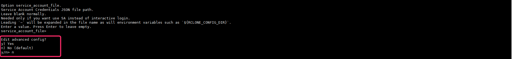

+++
author = "Hugo Authors"
title = "CentOS7上使用Rclone遠端備份至雲端"
date = "2022-11-27"
#description = ""
categories = [
    "rclone"
]
tags = [
    "rclone",
]
image = "100.png"
+++

    安裝依賴
    yum install curl unzip man-db

    安裝 Rclone
    curl https://rclone.org/install.sh | bash
    
   
   
    建立設定檔並進入交互式操作
    rclone config
    
    回答 n 以建立新的遠端服務 
    name 這邊以 goodle-drive 示範
    
   
   
    打入 Google Drive 對應序號 18
    
   
   
   
   
    client_id > 通常直接按 enter 不需填入
    
    client_secret > 通常直接按 enter 不需填入
    
    scope >  選 1 獲取全部權限
    
   
   
    root_folder_id > 通常直接按 enter 不需填入
    
    service_account_file > 通常直接按 enter 不需填入
    
    Edit advanced config ?  選 n 不需要進階設定

   
   
    Use web browser to automatically authenticate rclone with remote ?  選 n 遠程取 Token
    
    Use auto config ?   選 n 遠程取 Token
    
    並複製 TOKEN 至 config_token
    
    (取 TOKEN 看下面) 
    
   
    
   ***以下至 Windows 進行操作，驗證登入取 TOKEN***
    
    在本地 Windows 下載 rclone
    
   https://downloads.rclone.org/rclone-current-windows-amd64.zip
   
    載完解壓縮至慣用資料夾
    
   
   
    WIN + X + A 叫出 Powershell
    
    cd 至剛剛壓縮的資料夾底下 [.exe執行檔這層]
    
    執行語法 .\rclone authorize "要驗證的雲端"  ps. google_drive 為 drive
    
   

    驗證完成後會出現以下畫面
    
   
   
    最後將剛剛 powershell 驗證過的 TOKEN 貼入 LINUX
    
   
   
   ***常用語法 (以 dropbox 為例)***
   
|  rclone命令範例	                                        | 功能								    |
|  ----------------------------------------------------- 	| ------------------------------------- |
|  rclone lsd dropbox:路徑									| 列出資料夾						  	|
|  rclone ls dropbox:路徑									| 列出檔案 (路徑，大小)				   	|
|  rclone lsl dropbox:路徑									| 列出檔案的修改時間、路徑、大小等		|
|  rclone size dropbox:路徑									| 路徑 的檔案大小合計					|
|  rclone mkdir dropbox:路徑								| 建立資料夾 路徑						|
|  rclone rmdir dropbox:路徑								| 移除資料夾 路徑						|
|  rclone delete dropbox:路徑								| 刪除檔案								|
|  rclone –min-size 100M lsl dropbox:doc					| 列出 /doc 資料夾裡超過100MB的檔案		|
|  rclone –dry-run –min-size 100M delete dropbox:doc		| 測試一下會刪掉那些檔					|
|  rclone –min-size 100M delete dropbox:doc				| 確定刪除								|
|  rclone copy d:\doc\test.doc dropbox:doc					| 拷貝檔案								|
|  rclone copy dropoox:doc dropbox:backup/20160315			| 直接在Dropbox上拷貝檔案				|
|  rclone sync d:\doc dropbox:doc							| 同步處理								|
|  rclone -v												| 顯示所有指令與選項之說明				|

***




