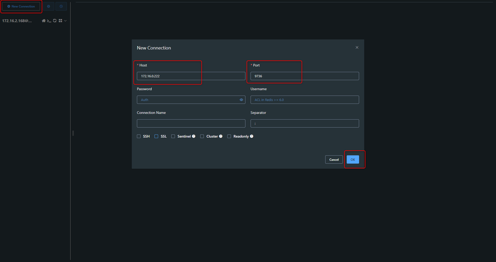
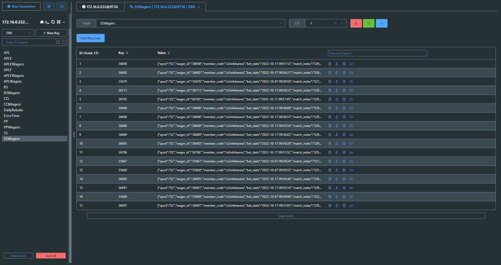

+++
author = "Hugo Authors"
title = "Redis-Another Redis Desktop Manager 建立遠端連線"
date = "2022-10-13"
#description = ""
categories = [
    "Database"
]
tags = [
    "Redis",
]
image = "100.png"
+++

[Another Redis Desktop Manager for windows](https://github.com/qishibo/AnotherRedisDesktopManager/releases)

    建立新連線
    
   
   
    測試成功
    
   
    

***




