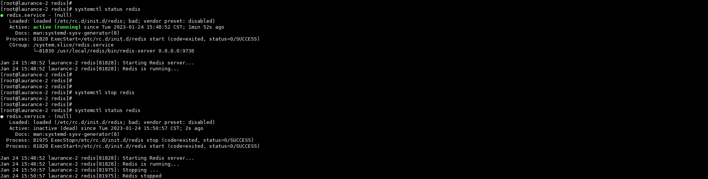
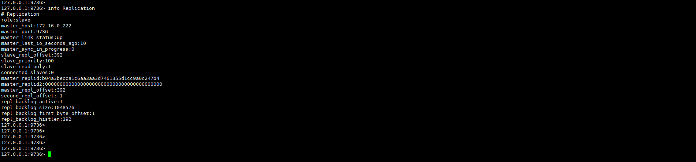

+++
author = "Hugo Authors"
title = "Redis-主從跟隨建立"
date = "2023-01-20"
#description = ""
categories = [
    "Cache"
]
tags = [
    "Redis",
]
image = "100.png"
+++

# Slave:
關閉 Redis-slave


修改 Redis 設定檔

    vim /usr/local/redis/etc/redis.conf

將 Redis 編號

    :set nu

在設定檔的第 327 行增加設定 ( REPLICATION區塊 )

    slave-read-only no
    
註解第 326 行設定
```sass
#replica-read-only yes
```

再開啟 Redis 服務

    systemctl start redis
    
登入並將 Slave 資料清空

    redis-cli -h 127.0.0.1 -p 9736 -a 密碼
    
    127.0.0.1:9736> flushall
    
    127.0.0.1:9736> OK

再將服務關閉

    systemctl stop redis
    
在設定檔的第 313 行增加設定

    slave-serve-stale-data yes
    
註解第 312 行設定
```sass
#replica-serve-stale-data yes
```
   
在設定檔的第 290 & 291 行增加設定 (Master資訊)

    slaveof 172.16.0.222 9736
    
    masterauth passwd
    
在設定檔的第 327 行修改設定

    slave-read-only yes
    
開啟 Redis 服務

    systemctl start redis
    
進去查看是否已重跟

    redis-cli -h 127.0.0.1 -p 9736 -a 密碼
    
    127.0.0.1:9736> info Replication
    
以下參數要是這樣 才算正常跟隨

    master_link_status:up
    
    master_last_io_seconds_ago:0
    
    master_sync_in_progress:0
    


PS:重新跟隨狀態會比較慢更新 (大約要等2分鐘 狀態才會變成up)


***


<style>
.emojify {
	font-family: Apple Color Emoji, Segoe UI Emoji, NotoColorEmoji, Segoe UI Symbol, Android Emoji, EmojiSymbols;
	font-size: 2rem;
	vertical-align: middle;
}
@media screen and (max-width:650px) {
  .nowrap {
    display: block;
    margin: 25px 0;
  }
}
</style>

