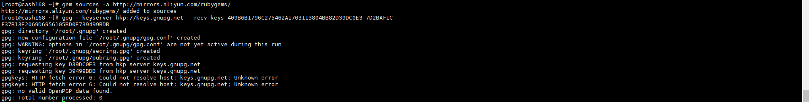
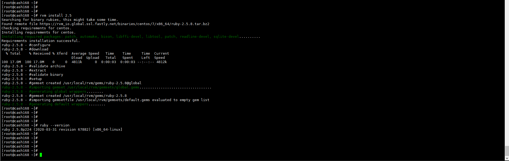
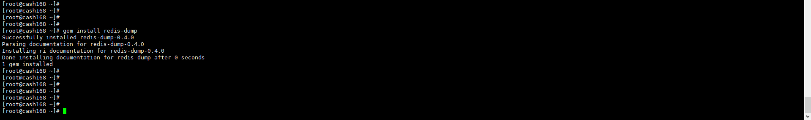

+++
author = "Hugo Authors"
title = "Redis-安裝reids-dump備份"
date = "2022-10-22"
#description = ""
categories = [
    "Cache"
]
tags = [
    "Redis",
]
image = "100.png"
+++

**需先安裝 redis-cli**

**安裝ruby跟gem**



yum -y install ruby ruby-devel

yum -y install rubygems



**使用gem裝rvm**



載入來源及憑證

gem sources -a http://mirrors.aliyun.com/rubygems/

gpg --keyserver hkp://keys.gnupg.net --recv-keys 409B6B1796C275462A1703113804BB82D39DC0E3 7D2BAF1CF37B13E2069D6956105BD0E739499BDB





使用腳本安裝

curl -sSL https://get.rvm.io | bash -s stable





這時會報錯讀不到憑證 再重新載入一次即可

curl -sSL https://rvm.io/mpapis.asc | gpg2 --import -

curl -sSL https://rvm.io/pkuczynski.asc | gpg2 --import -

再重新安裝一次

curl -sSL https://get.rvm.io | bash -s stable





載入rvm腳本

source /etc/profile.d/rvm.sh

rvm版本確認

rvm -v



**再用rvm升級ruby**



安裝ruby 2.5版

rvm install 2.5

ruby版本確認

ruby --version



**再用gem安裝redis-dump**



gem install redis-dump





報錯 ERROR 需要再安裝 yajl-ruby





gem install yajl-ruby -v 1.4.1

gem install redis-dump

重新再安裝一次即可



**redis備份及匯入語法 (可以使用別台的IP 遠端備份)**

    EX:
    
    備份語法
    
    redis-dump -u 127.0.0.1:9736 -a 'redisPasword' > /root/info-redis-bak.json
    
    匯入語法
    
    <info-redis-bak.json redis-load -u 127.0.0.1:9736
    

***




