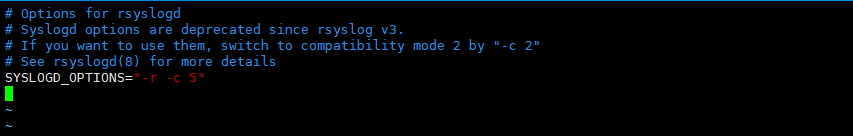
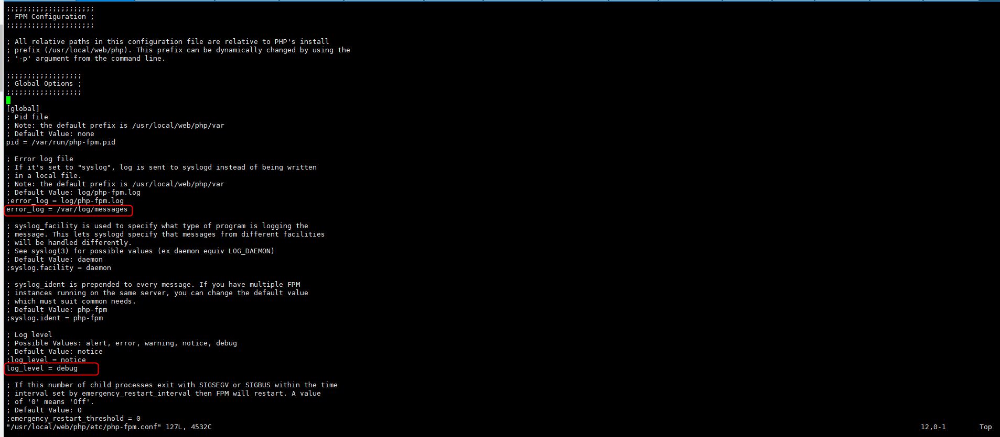
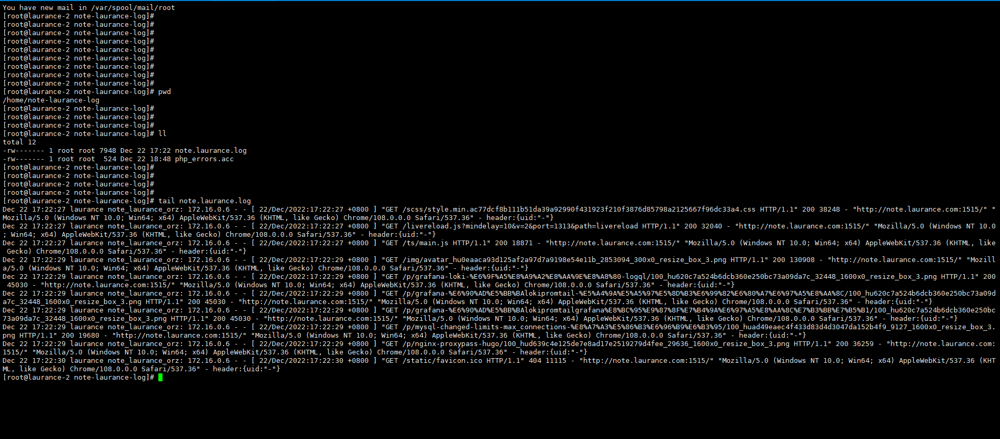

+++
author = "Hugo Authors"
title = "Rsyslog日誌遠端集中式管理"
date = "2022-12-21"
description = "Rsyslog 同步寫LOG並使用排程管理"
categories = [
    "Linux"
]
tags = [
    "Rsyslog",
]
image = "100.png"
+++
   
   查看相關配置   
    
    rpm -qc rsyslog
    
```
   /etc/logrotate.d/syslog
   /etc/rsyslog.conf
   /etc/sysconfig/rsyslog
```

   查看版本
   
    rsyslogd -v
    
```
rsyslogd 8.24.0-57.el7_9.3, compiled with:
	PLATFORM:				x86_64-redhat-linux-gnu
	PLATFORM (lsb_release -d):		
	FEATURE_REGEXP:				Yes
	GSSAPI Kerberos 5 support:		Yes
	FEATURE_DEBUG (debug build, slow code):	No
	32bit Atomic operations supported:	Yes
	64bit Atomic operations supported:	Yes
	memory allocator:			system default
	Runtime Instrumentation (slow code):	No
	uuid support:				Yes
	Number of Bits in RainerScript integers: 64
```

   更改 rsyslog 參數 (-c 後為版本號 , -r 為開啟遠端接收)
   
    vim /etc/sysconfig/rsyslog
    
   
   
##CLIENT

   RSYSLOG設定檔配置

    vim /etc/rsyslog.conf
    
```angular2html

# rsyslog configuration file

# For more information see /usr/share/doc/rsyslog-*/rsyslog_conf.html
# If you experience problems, see http://www.rsyslog.com/doc/troubleshoot.html

#### MODULES ####

# The imjournal module bellow is now used as a message source instead of imuxsock.
$ModLoad imuxsock # provides support for local system logging (e.g. via logger command)
$ModLoad imjournal # provides access to the systemd journal
#$ModLoad imklog # reads kernel messages (the same are read from journald)
#$ModLoad immark  # provides --MARK-- message capability
#$ModLoad imfile

# Provides UDP syslog reception
#$ModLoad imudp
#$UDPServerRun 514

# Provides TCP syslog reception
#$ModLoad imtcp
#$InputTCPServerRun 514


#### GLOBAL DIRECTIVES ####

# Where to place auxiliary files
$WorkDirectory /var/lib/rsyslog

# Use default timestamp format
$ActionFileDefaultTemplate RSYSLOG_TraditionalFileFormat

# File syncing capability is disabled by default. This feature is usually not required,
# not useful and an extreme performance hit
#$ActionFileEnableSync on

# Include all config files in /etc/rsyslog.d/
$IncludeConfig /etc/rsyslog.d/*.conf

# Turn off message reception via local log socket;
# local messages are retrieved through imjournal now.
$OmitLocalLogging on

# File to store the position in the journal
$IMJournalStateFile imjournal.state


#### RULES ####

# Log all kernel messages to the console.
# Logging much else clutters up the screen.
#kern.*                                                 /dev/console

# Log anything (except mail) of level info or higher.
# Don't log private authentication messages!
*.info;mail.none;authpriv.none;cron.none                /var/log/messages

# The authpriv file has restricted access.
authpriv.*                                              /var/log/secure.log

# Log all the mail messages in one place.
mail.*                                                  -/var/log/maillog.log


# Log cron stuff
cron.*                                                  /var/log/cron.log

# Everybody gets emergency messages
*.emerg                                                 :omusrmsg:*

# Save news errors of level crit and higher in a special file.
uucp,news.crit                                          /var/log/spooler.log

# Save boot messages also to boot.log
local7.*                                                /var/log/boot.log

#*.* 							                        @@172.16.0.223:514
:msg, contains, "PHP"					                @172.16.0.223       #紀錄在messages裡有"PHP"關鍵字的LOG

#include(file="/etc/rsyslog.d/*.conf")

#:programname,isequal,"dhclient"                         /var/log/dhclient.log
#:programname,isequal,"ec2net"                           /var/log/dhclient.log

# ### begin forwarding rule ###
# The statement between the begin ... end define a SINGLE forwarding
# rule. They belong together, do NOT split them. If you create multiple
# forwarding rules, duplicate the whole block!
# Remote Logging (we use TCP for reliable delivery)
#
# An on-disk queue is created for this action. If the remote host is
# down, messages are spooled to disk and sent when it is up again.
#$ActionQueueFileName fwdRule1 # unique name prefix for spool files
#$ActionQueueMaxDiskSpace 1g   # 1gb space limit (use as much as possible)
$ActionQueueSaveOnShutdown on # save messages to disk on shutdown
#$ActionQueueType LinkedList   # run asynchronously
#$ActionResumeRetryCount -1    # infinite retries if host is down
# remote host is: name/ip:port, e.g. 192.168.0.1:514, port optional
#*.* @@remote-host:514
# ### end of the forwarding rule ###
$IncludeConfig /etc/rsyslog.d/*.conf

```

   RSYSLOG 服務重啟
   
    systemctl restart rsyslog

NGINX 設定檔配置 (web-server-log)

```angular2html

server {

    listen 1515;
    listen [::]:1515;
    server_name note.laurance.com;

        location  / {
#       auth_basic      "authentication";
#       auth_basic_user_file conf/mypasswords/.hugopass.dev;
        proxy_set_header X-Real-IP $remote_addr;
        proxy_set_header X-Forwarded-For $proxy_add_x_forwarded_for;
        proxy_redirect off;
        proxy_http_version 1.1;
        proxy_pass http://127.0.0.1:1313;
        proxy_set_header X_FORWARDED_HOST $host;
        proxy_set_header Host $http_host;
        proxy_ignore_client_abort on;
        proxy_read_timeout 300;

        proxy_ignore_headers "Cache-Control";
        add_header X-Cache "$upstream_cache_status from $server_addr";
        add_header Cache-Control  max-age=60;
        proxy_cache_valid  304 1m;
#       proxy_cache two;
        proxy_cache_key $host$uri$is_args$args;
  }
#    auth_basic      "authentication";
#    auth_basic_user_file conf/mypasswords/.hugopass.dev;
    access_log logs/hugo-server/hugo-server.acc access;
    access_log  syslog:server=172.16.0.223:514,tag=note_laurance_orz  access;
}

```

   NGINX 服務重啟
   
    /usr/local/web/nginx/sbin/nginx -t
    
    /usr/local/web/nginx/sbin/nginx -s reload

PHP設定檔配置 (定義 error_log 位置及層級)

    vim /usr/local/web/php/etc/php-fpm.conf
    
   
    
    

##SERVER

   RSYSLOG設定檔配置

    vim /etc/rsyslog.conf
    
```angular2html

# rsyslog configuration file

# For more information see /usr/share/doc/rsyslog-*/rsyslog_conf.html
# If you experience problems, see http://www.rsyslog.com/doc/troubleshoot.html

#### MODULES ####

# The imjournal module bellow is now used as a message source instead of imuxsock.
$ModLoad imuxsock # provides support for local system logging (e.g. via logger command)
$ModLoad imjournal # provides access to the systemd journal
#$ModLoad imklog # reads kernel messages (the same are read from journald)
#$ModLoad immark  # provides --MARK-- message capability

# Provides UDP syslog reception
$ModLoad imudp
$UDPServerRun 514

# Provides TCP syslog reception
$ModLoad imtcp
$InputTCPServerRun 514


#### GLOBAL DIRECTIVES ####

# Where to place auxiliary files
$WorkDirectory /var/lib/rsyslog

# Use default timestamp format
$ActionFileDefaultTemplate RSYSLOG_TraditionalFileFormat

# File syncing capability is disabled by default. This feature is usually not required,
# not useful and an extreme performance hit
#$ActionFileEnableSync on

# Include all config files in /etc/rsyslog.d/
$IncludeConfig /etc/rsyslog.d/*.conf

# Turn off message reception via local log socket;
# local messages are retrieved through imjournal now.
$OmitLocalLogging on

# File to store the position in the journal
$IMJournalStateFile imjournal.state


#### RULES ####

# Log all kernel messages to the console.
# Logging much else clutters up the screen.
#kern.*                                                 /dev/console

# Log anything (except mail) of level info or higher.
# Don't log private authentication messages!
*.info;mail.none;authpriv.none;cron.none                /var/log/messages

# The authpriv file has restricted access.
authpriv.*                                              /var/log/secure

# Log all the mail messages in one place.
mail.*                                                  -/var/log/maillog


# Log cron stuff
cron.*                                                  /var/log/cron

# Everybody gets emergency messages
*.emerg                                                 :omusrmsg:*

# Save news errors of level crit and higher in a special file.
uucp,news.crit                                          /var/log/spooler

# Save boot messages also to boot.log
#local7.*                                                /var/log/boot.log

#:programname,isequal,"dhclient"                         /var/log/dhclient.log
#:programname,isequal,"ec2net"                           /var/log/dhclient.log

# ### begin forwarding rule ###
# The statement between the begin ... end define a SINGLE forwarding
# rule. They belong together, do NOT split them. If you create multiple
# forwarding rules, duplicate the whole block!
# Remote Logging (we use TCP for reliable delivery)
#
# An on-disk queue is created for this action. If the remote host is
# down, messages are spooled to disk and sent when it is up again.
#$ActionQueueFileName fwdRule1 # unique name prefix for spool files
#$ActionQueueMaxDiskSpace 1g   # 1gb space limit (use as much as possible)
#$ActionQueueSaveOnShutdown on # save messages to disk on shutdown
#$ActionQueueType LinkedList   # run asynchronously
#$ActionResumeRetryCount -1    # infinite retries if host is down
# remote host is: name/ip:port, e.g. 192.168.0.1:514, port optional
#*.* @@remote-host:514
# ### end of the forwarding rule ###
$IncludeConfig /etc/rsyslog.d/*.conf

```    
   
   ##在rsyslog.d目錄下建立 xxx.conf 定義 Client 端 log 的標籤及路徑
   
   vim /etc/rsyslog.d/note_laurance.conf
   
    :syslogtag, contains, "note_laurance_orz" /home/note-laurance-log/note.laurance.log
    & stop
    .
    .
    .
    .
    .
    
   vim /etc/rsyslog.d/php_error.conf
   
    if  $msg contains 'PHP'  then /home/note-laurance-log/php_errors.acc
    & stop
    .
    .
    .
    .
    .
    
   RSYSLOG 服務重啟
   
    systemctl restart rsyslog
   
##驗證:

   訪問 note.laurance.com:1515 可以看到 LOG 被同步寫進指定位置了
   
   
   
##建立每天排程LOG輪詢

   建立排程 shell
   
    vim /root/logrotate/logrotate.sh
    
```angular2html
#!/bin/bash

/usr/sbin/logrotate -f /root/logrotate/weblog

```
   
    vim /root/logrotate/weblog
    
```angular2html
/home/note-laurance-log/*.log {
           daily
           rotate 30
           create
           sharedscripts
           postrotate
           /bin/systemctl restart rsyslog.service
           endscript
}

/home/note-laurance-log/*.acc {
           daily
           rotate 30
           create
           sharedscripts
           postrotate
           /bin/systemctl restart rsyslog.service
           endscript
}

```

    crontab -e
    
    10 05 * * * sh /root/logrotate/logrotate.sh
    
   crontab -l 確認

   [Rsyslog 官方文件](https://www.rsyslog.com/doc/v8-stable/index.html)
   
   
    


***


<style>
.emojify {
	font-family: Apple Color Emoji, Segoe UI Emoji, NotoColorEmoji, Segoe UI Symbol, Android Emoji, EmojiSymbols;
	font-size: 2rem;
	vertical-align: middle;
}
@media screen and (max-width:650px) {
  .nowrap {
    display: block;
    margin: 25px 0;
  }
}
</style>

