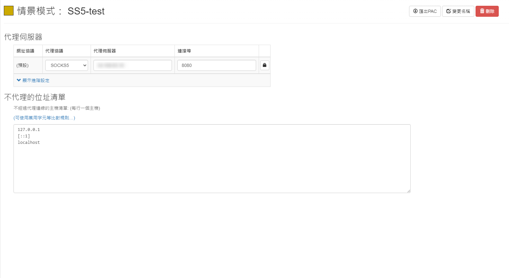

+++
author = "Hugo Authors"
title = "VPN-建置 SOCKS5(SS5)代理"
date = "2022-12-26"
#description = "L2TP/IPsec VPN Server Docker Image"
categories = [
    "SOCKS5"
]
tags = [
    "SOCKS5",
]
image = "100.jpg"
+++

   從官網下載源碼
   
    wget https://nchc.dl.sourceforge.net/project/ss5/ss5/3.8.9-8/ss5-3.8.9-8.tar.gz
    
   安裝依賴
   
    yum -y install pam-devel openldap-devel cyrus-sasl-devel openssl-devel gcc automake make
    
   解壓、編譯、安裝
   
    tar xvf ss5-3.8.9-8.tar.gz
    
    cd ss5-3.8.9
    
    ./configure && make && make install
    
[ SS5設定檔 ]

   修改認證方式
   
    vim /etc/opt/ss5/ss5.conf
    
   無帳號密碼的設定
   
 ```json

auth    0.0.0.0/0               -              -
permit -       0.0.0.0/0       -       0.0.0.0/0       -       -       -       -       -

```

   有帳號密碼的設定
   
```json

auth    0.0.0.0/0               -              u
permit u        0.0.0.0/0       -       0.0.0.0/0       -       -       -       -       -

```
    
   加入 USER 及 PASSWD
   
    vim /etc/opt/ss5/ss5.passwd
    
```javascript

laurance lau888

```

   修改 ss5 啟動的 port
   
    vim /etc/sysconfig/ss5
    
```javascript

SS5_OPTS=" -u root -b 0.0.0.0:8080"

```

   新增 ss5 執行檔權限
   
    chmod 755 /etc/rc.d/init.d/ss5
    
   啟動服務
   
    systemctl restart ss5
    
   查看啟動 LOG
   
    more /var/log/ss5/ss5.log
    
[ Chrome 套件名稱: Proxy SwitchyOmega ]

   使用 Chrome 套件 & SS5 翻牆
   
   
    
***


<style>
.emojify {
	font-family: Apple Color Emoji, Segoe UI Emoji, NotoColorEmoji, Segoe UI Symbol, Android Emoji, EmojiSymbols;
	font-size: 2rem;
	vertical-align: middle;
}
@media screen and (max-width:650px) {
  .nowrap {
    display: block;
    margin: 25px 0;
  }
}
</style>

