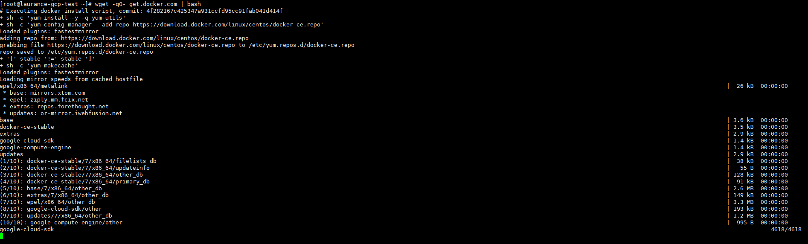
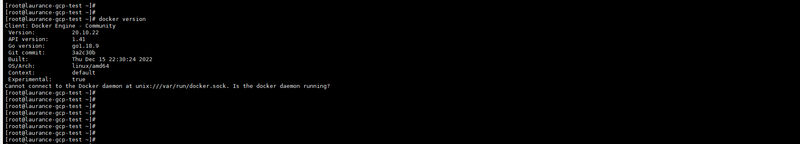
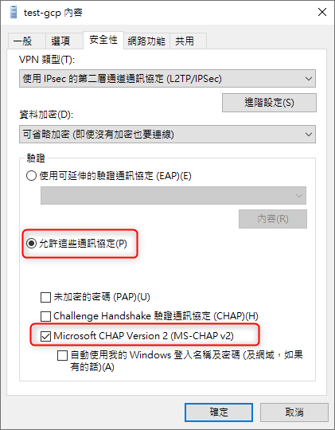
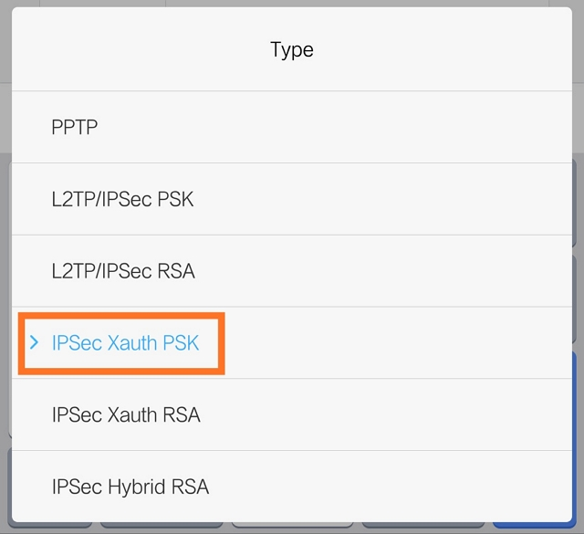

+++
author = "Hugo Authors"
title = "VPN-建置 XL2TPD + IPSec 服務 by DOCKER"
date = "2022-12-27"
description = "L2TP/IPsec VPN Server Docker Image"
categories = [
    "XL2TPD"
]
tags = [
    "XL2TPD",
]
image = "100.jpg"
+++

   [DOCKER]
   
   安裝最新版 Docker
   
    wget -qO- get.docker.com | bash 
    
   
    
   查看版本
   
    docker version 

   
   
   啟動服務
   
    systemctl start docker 
  
   查看狀態
   
    systemctl status docker
    
   [L2TP/IPsec]
   
   拉取鏡像
   
    docker pull teddysun/l2tp
    
   建立環境參數設定檔
   
    vim /etc/l2tp.env
    
```javascript

VPN_IPSEC_PSK=1234567890
VPN_USER=laurance
VPN_PASSWORD=lau888
VPN_PUBLIC_IP=XX.XX.XX.XX
VPN_L2TP_NET=192.168.18.0/24
VPN_L2TP_LOCAL=192.168.18.1
VPN_L2TP_REMOTE=192.168.18.10-192.168.18.250
VPN_XAUTH_NET=192.168.20.0/24
VPN_XAUTH_REMOTE=192.168.20.10-192.168.20.250
VPN_DNS1=8.8.8.8
VPN_DNS2=9.9.9.9
VPN_SHA2_TRUNCBUG=

```
  
```javascript

VPN_IPSEC_PSK：預共享密鑰
VPN_USER：默認的登錄用戶名
VPN_PASSWORD：默認的登錄用戶密碼
VPN_PUBLIC_IP：指定公網 IP 地址，當你的 VPS 有多個公網 IP 時，可能需要手動指定一下
VPN_L2TP_NET：內網 L2TP 網段範圍，默認為 192.168.18.0/24，一般此處留空即可
VPN_L2TP_LOCAL：內網 L2TP 網關 IP，默認為 192.168.18.1，一般此處留空即可
VPN_L2TP_REMOTE：內網 L2TP 網段分配給連接的 IP 段，默認為 192.168.18.10-192.168.18.250，一般此處留空即可
VPN_XAUTH_NET：內網 XAUTH 網段範圍，默認為 192.168.20.0/24，一般此處留空即可
VPN_XAUTH_REMOTE：內網 XAUTH 網段分配給連接的 IP 段，默認為 192.168.20.10-192.168.20.250，一般此處留空即可
VPN_DNS1：默認 DNS 服務器，8.8.8.8，一般此處留空即可
VPN_DNS2：默認 DNS 服務器，8.8.4.4，一般此處留空即可
Android 6 和 7 用戶：如果你遇到連接問題，請嘗試在 /etc/ipsec.conf 中設置 sha2-truncbug=yes（默認為 no），你可以在 /etc/l2tp.env 文件中添加 VPN_SHA2_TRUNCBUG=yes，然後重新創建 Docker 容器。

```

   啟動容器
   
    docker run -d --privileged -p 500:500/udp -p 4500:4500/udp --name l2tp --restart=always --env-file /etc/l2tp.env -v /lib/modules:/lib/modules teddysun/l2tp
    
   查看啟動 LOG
   
    docker logs l2tp
    
   查看 ipsec status 輸出
   
    docker exec -it l2tp ipsec status
    
[管理 VPN 用户]

   列出所有 user & password
   
    docker exec -it l2tp l2tpctl -l
    
   新增 user
   
    docker exec -it l2tp l2tpctl -a
    
   刪除 user
   
    docker exec -it l2tp l2tpctl -d
    
   修改 user 密碼
   
    docker exec -it l2tp l2tpctl -m
    
   查看 libreswan 和 xl2tpd 版本 
   
    docker exec -it l2tp l2tpctl -v 
    
```angularjs
Linux Libreswan 3.32 (netkey) on 3.10.0-1160.76.1.el7.x86_64

xl2tpd version:  xl2tpd-1.3.15

```

[Windows 10 下连接 L2TP VPN]

   修改 VPN 協議
   
  
  
   Configure a L2TP/IPsec server behind a NAT-T device
   
    win + R 輸入 regedit
    
    HKEY_LOCAL_MACHINE\SYSTEM\CurrentControlSet\Services\PolicyAgent
    
    新增一組機碼 >> DWORD（32 位）值 >> AssumeUDPEncapsulationContextOnSendRule >> 值設定為 2 (1 不會過)
    
[PHONE]

   Android 版本小於或等於 7 時，建議選擇 IPSec Xauth PSK (Cisco IPsec) 模式連接
   
   
    
   [參考] https://learn.microsoft.com/en-US/troubleshoot/windows-server/networking/configure-l2tp-ipsec-server-behind-nat-t-device
   
   [參考] https://teddysun.com/536.html
    
    
    
***


<style>
.emojify {
	font-family: Apple Color Emoji, Segoe UI Emoji, NotoColorEmoji, Segoe UI Symbol, Android Emoji, EmojiSymbols;
	font-size: 2rem;
	vertical-align: middle;
}
@media screen and (max-width:650px) {
  .nowrap {
    display: block;
    margin: 25px 0;
  }
}
</style>

