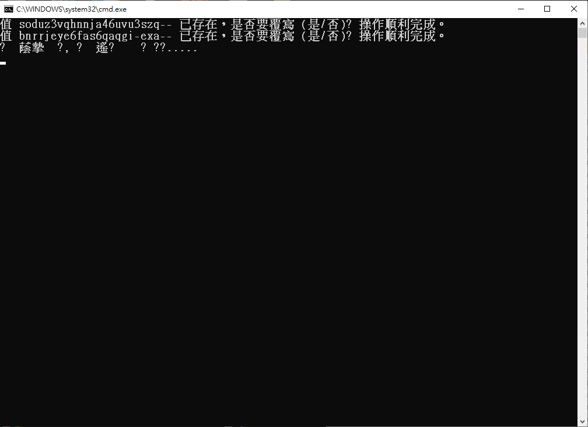
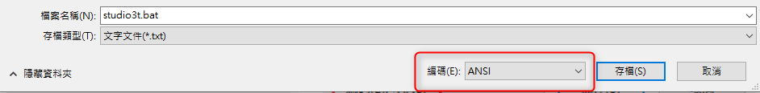
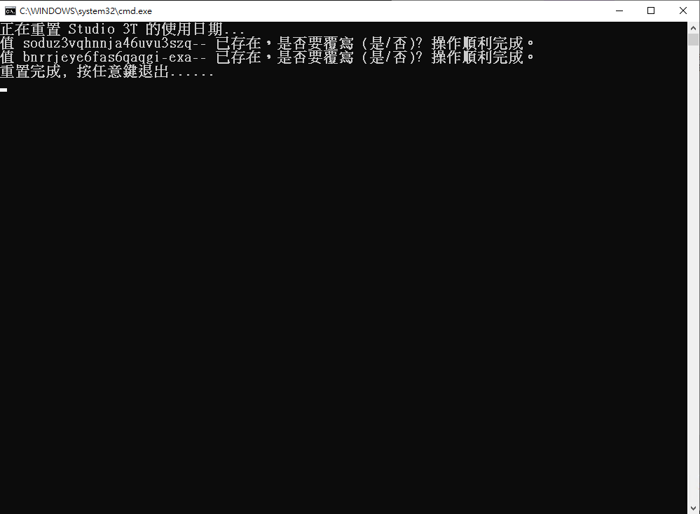

+++
author = "Hugo Authors"
title = "Windows-bat批處理腳本中文亂碼問題解決"
date = "2023-03-02"
#description = ""
categories = [
    "Windows"
]
tags = [
    "Windows",
]
image = "100.png"
+++

# bat 處理腳本如下

```yaml
@echo off
ECHO 正在重置 Studio 3T 的使用日期...
FOR /f "tokens=1,2,* " %%i IN ('reg query "HKEY_CURRENT_USER\Software\JavaSoft\Prefs\3t\mongochef\enterprise" ^| find /V "installation" ^| find /V "HKEY"') DO ECHO yes | reg add "HKEY_CURRENT_USER\Software\JavaSoft\Prefs\3t\mongochef\enterprise" /v %%i /t REG_SZ /d ""
ECHO 重置完成, 按任意键退出......
pause>nul
exit
```  

CMD 執行腳本時出現亂碼



# 解決方法

將 `bat執行檔` 另存為 `ANSI編碼格式`



再次運行,亂碼問題已解決




***


<style>
.emojify {
	font-family: Apple Color Emoji, Segoe UI Emoji, NotoColorEmoji, Segoe UI Symbol, Android Emoji, EmojiSymbols;
	font-size: 2rem;
	vertical-align: left;
}
@media screen and (max-width:650px) {
  .nowrap {
    display: block;
    margin: 25px 0;
  }
}
</style>

