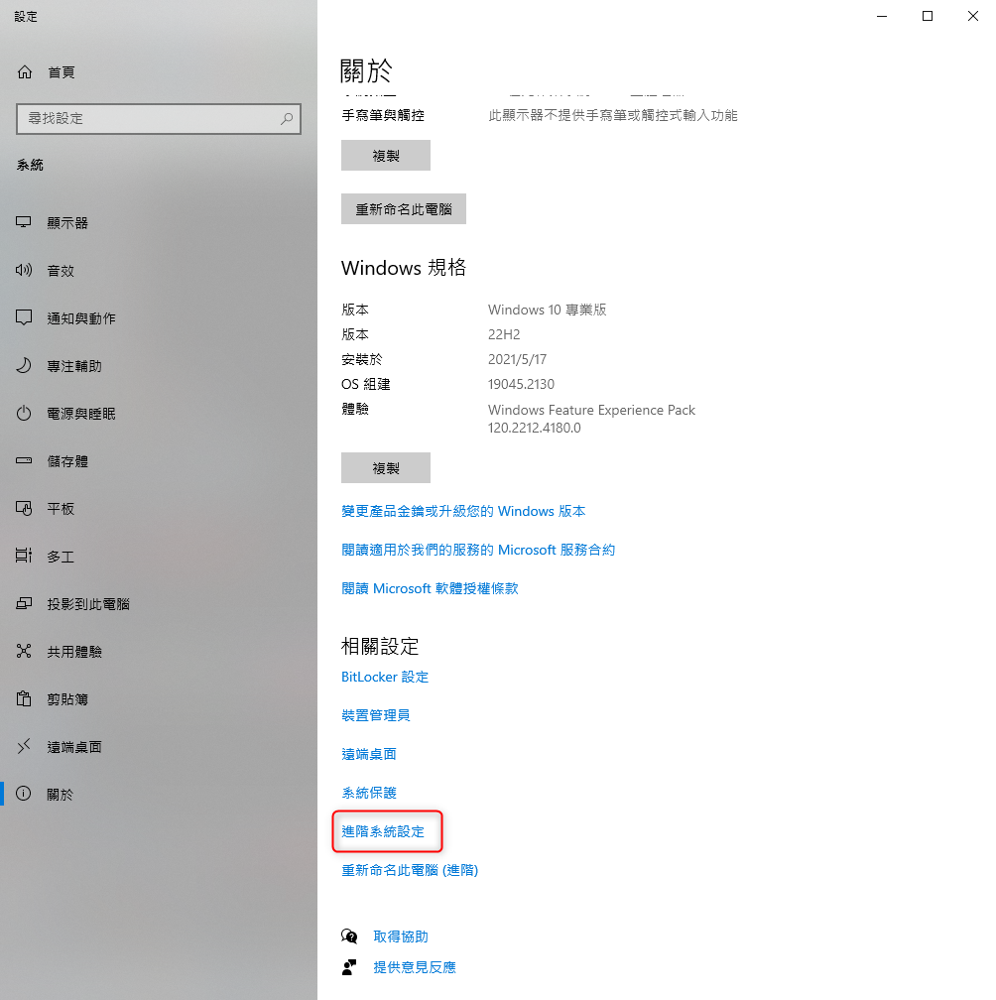

+++
author = "Hugo Authors"
title = "Windows-安裝影片下載工具 youtube-dl"
date = "2023-02-15"
#description = "()"
categories = [
    "Windows"
]
tags = [
    "youtube-dl",
]
image = "100.png"
+++

# Windows 安裝 youtube-dl 紀錄

官方網站 http://ytdl-org.github.io/youtube-dl/download.html

〔Step 1〕官網安裝套件

Windows 需安裝 
[Microsoft Visual C++ 2010 Service Pack 1 Redistributable Package (x86)](https://download.microsoft.com/download/1/6/5/165255E7-1014-4D0A-B094-B6A430A6BFFC/vcredist_x86.exe)
 、 [Windows exe (youtube-dl for windows)](https://yt-dl.org/downloads/2021.12.17/youtube-dl.exe)

〔Step 2〕將 "youtube-dl.exe" 移至路徑 `%USERPROFILE%\AppData\Local\Microsoft\WindowsApps` 裡

    %USERPROFILE%\AppData\Local\Microsoft\WindowsApps   
    
    Windows 預設環境變數路徑
    

〔Step 3〕確認上述路徑有在 PATH 中

〔Step 4〕驗證: 打開 CMD 輸入 youtube-dl --version

〔Step 5〕下載影片:

直接下載

    youtube-dl u5ZsoP8FZUQ
    
查詢影片可下載的畫質清單

    youtube-dl -F u5ZsoP8FZUQ
    

上述指令找到 `format code` 後，使用下列指令下載指定的畫質影片

    youtube-dl -f 401 u5ZsoP8FZUQ
    
下載成音樂 `--audio-format` 指定輸出格式，預設值為 `best`

    youtube-dl -x --audio-format mp4 u5ZsoP8FZUQ

***




