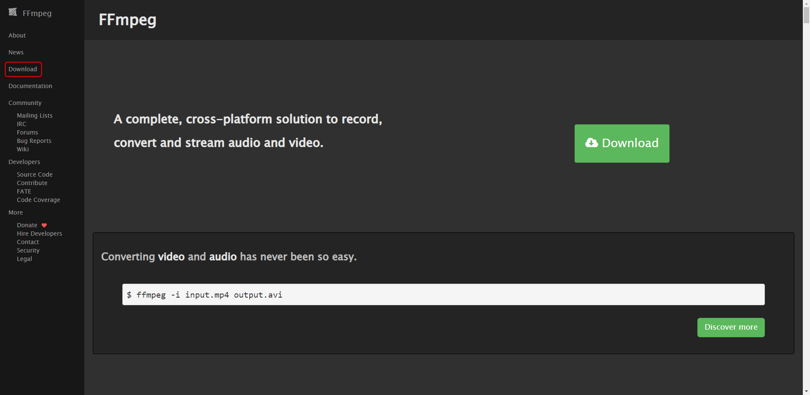
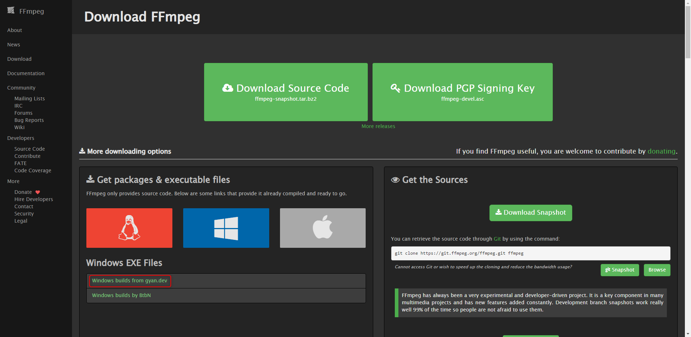
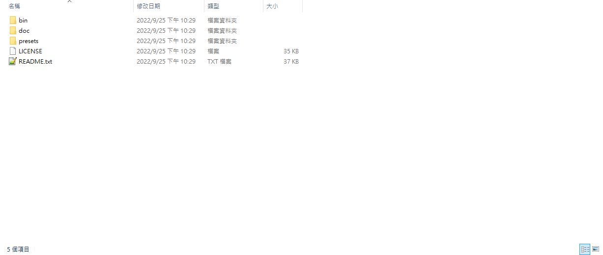
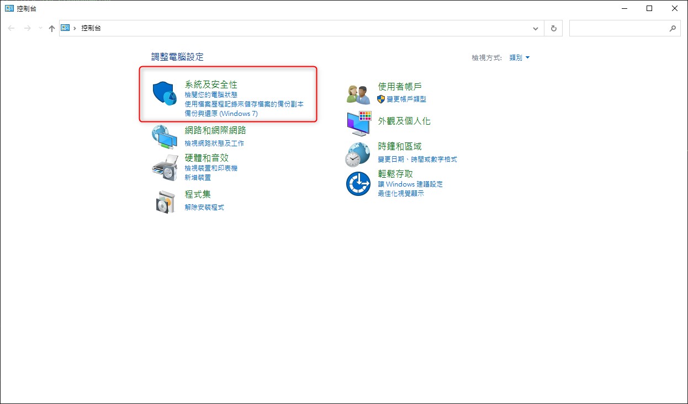
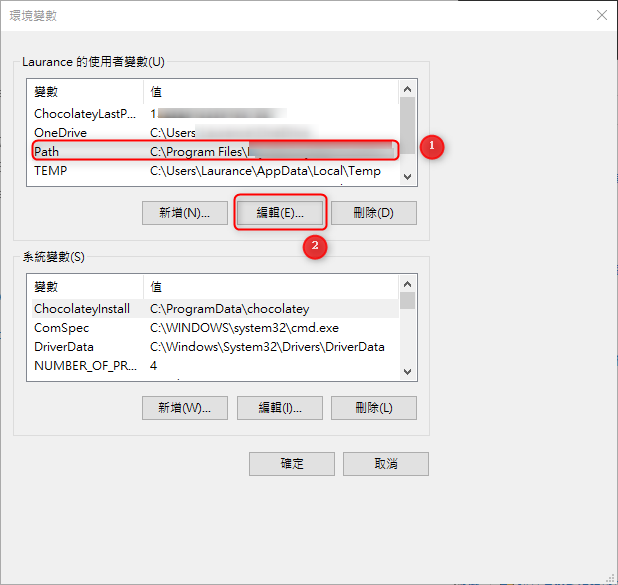
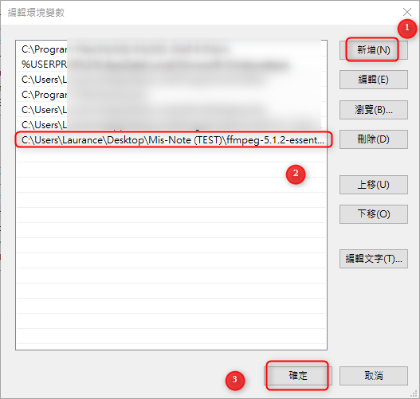
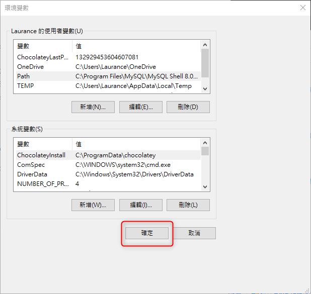
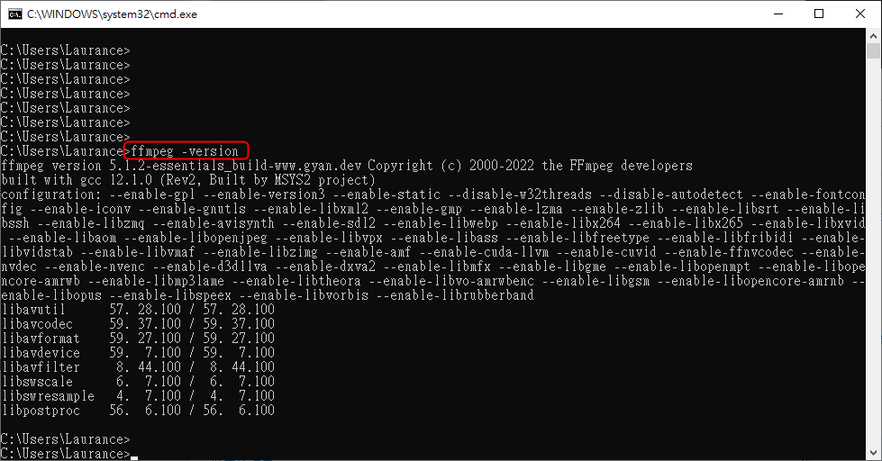
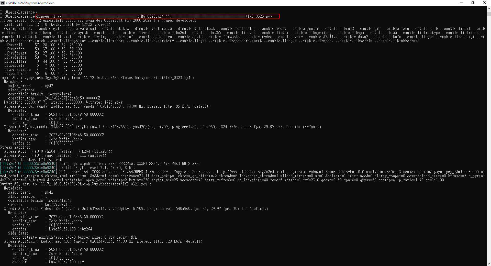

+++
author = "Hugo Authors"
title = "Windows-安裝轉檔工具 FFmpeg"
date = "2023-02-15"
description = "(影音轉檔教學 mov/mp4轉檔)"
categories = [
    "Windows"
]
tags = [
    "FFmpeg",
]
image = "100.png"
+++

# Windows  FFmpeg 安裝紀錄

官方網站 https://ffmpeg.org/download.html#build-windows

〔Step 1〕先去官網下載 FFmpeg

〔Step 2〕將載好的 zip包解壓縮

    裡面應該要有這些檔案
    

〔Step 3〕進去到 ./bin 這層目錄並將路徑複製到環境變數中

〔Step 4〕打開控制台 > 系統及安全性 > 系統 > 進階系統設定

〔Step 5〕打開環境變數 > 系統變數 > Path > 編輯 > 新增

    將 〔Step 3〕 複製的路徑貼入
    

〔Step 6〕驗證: 打開 CMD 輸入: ffmpeg -version

〔Step 7〕將 mp4 轉成 mov

***




