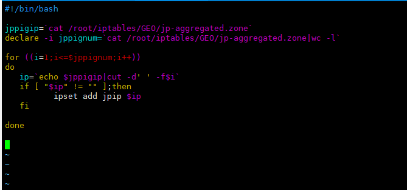
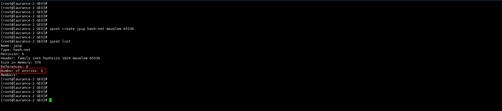
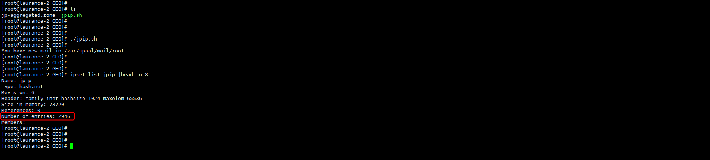
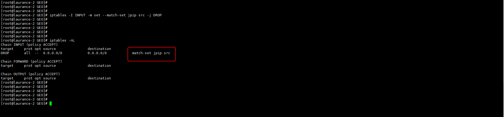

+++
author = "Hugo Authors"
title = "Linux-利用ipset建立iptables集合 [實現封鎖國家IP] "
date = "2022-12-05"
description = "這邊記錄一下用日本IP實測"
categories = [
    "Linux"
]
tags = [
    "Iptables",
]
image = "100.jpg"
+++
    
   [DENY - 國家IP](https://www.ipdeny.com/ipblocks/)
   
    yum -y install ipset
    
   下載日本IP文件檔
    
    wget http://www.ipdeny.com/ipblocks/data/aggregated/jp-aggregated.zone
    
   建立一個放日本IP的集合
    
    ipset create jpip hash:net maxelem 65536
    
   建立一支shell來抓取文件檔中的IP
   
    vim jpip.sh
    
   
   
   查看目前集合中IP為0
   
    ipset list jpip
    
   
    
   執行shell之後集合中的IP為2946
   
    ipset list jpip |head -n 8
    
   
   
   查看list-jpip中有多少個IP (從第九行開始算)
   
    ipset list jpip |tail -n +9 |wc -l
    
   對照文檔中的IP數量是否一致
   
    cat jp-aggregated.zone |wc -l
    
   最後使用iptables將此集合中IP進來的封包 DROP掉
   
    iptables -I INPUT -m set --match-set jpip src -j DROP 
    
   
   
   
   [IPSET 官網](https://www.ipdeny.com/ipblocks/)
   
   ***src 表示源地址，dst表示目標地址***
   
   ***hash:net 用什麼進行hash ，也可以是hash:ip 就只能ip不能網段 hash:ip,port ip+port進行hash***
   
   ***也可以有timeout 數字 這種參數，指定這個集合裏默認的超時時間單位s，超時後會自動把裏面的對象刪除***
   
   [常用語法]
   
    ipset del yoda x.x.x.x    # 從 yoda 集合中刪除內容  
    
    ipset list yoda           # 查看 yoda 集合內容  
    
    ipset list                # 查看所有集合的內容  
    
    ipset flush yoda          # 清空 yoda 集合  
    
    ipset flush               # 清空所有集合  
    
    ipset destroy yoda        # 銷毀 yoda 集合  
    
    ipset destroy             # 銷毀所有集合  
    
    ipset save yoda           # 輸出 yoda 集合內容到標準輸出  
    
    ipset save                # 輸出所有集合內容到標準輸出  
    
    ipset restore             # 根據輸入內容恢復集合內容  
    

***




