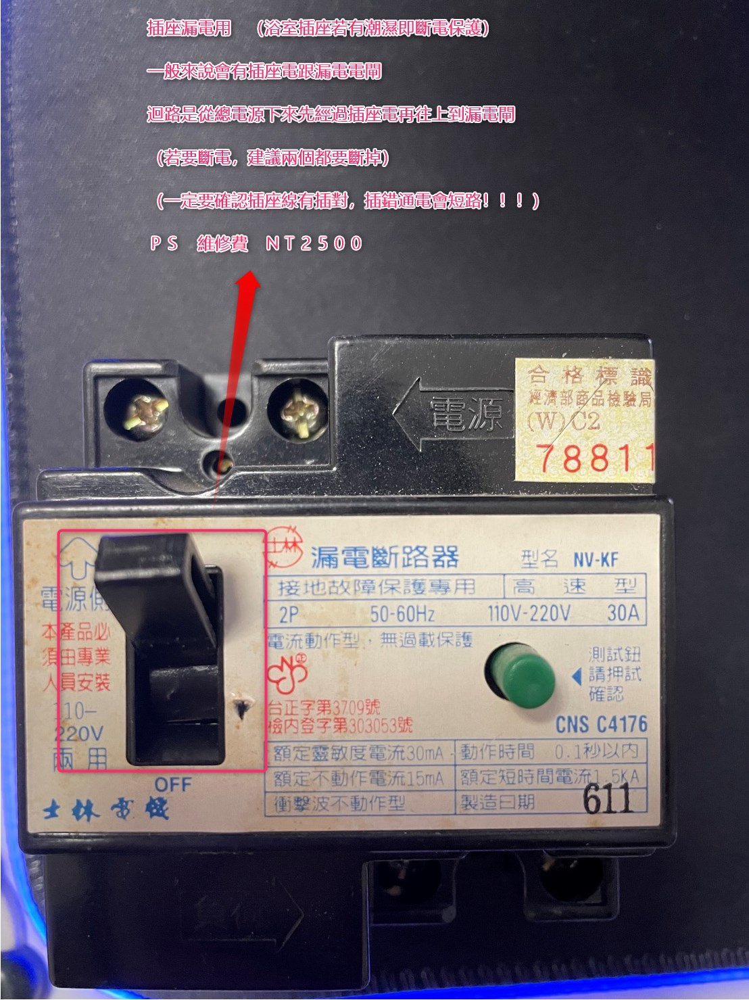
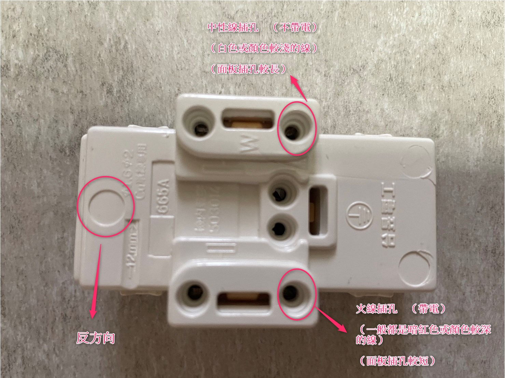
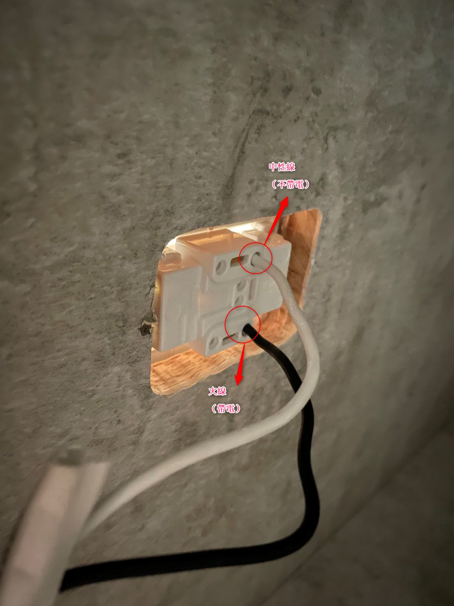
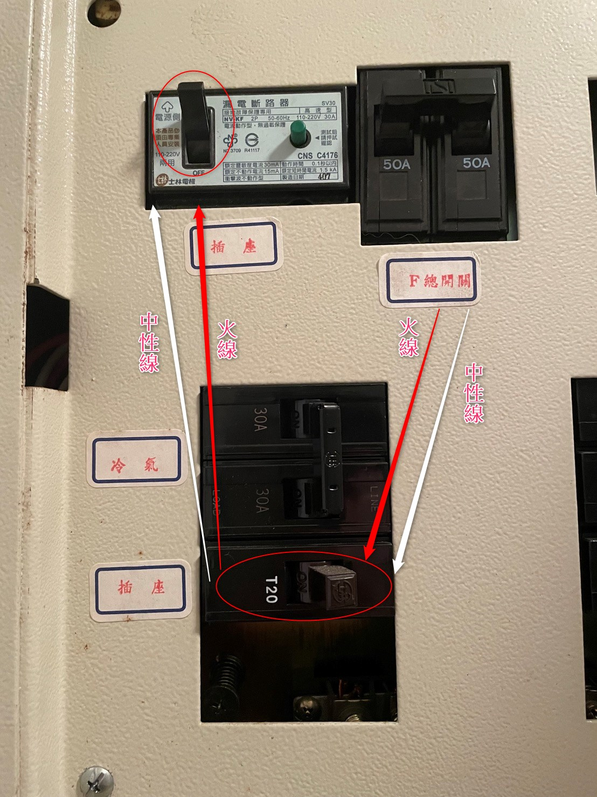
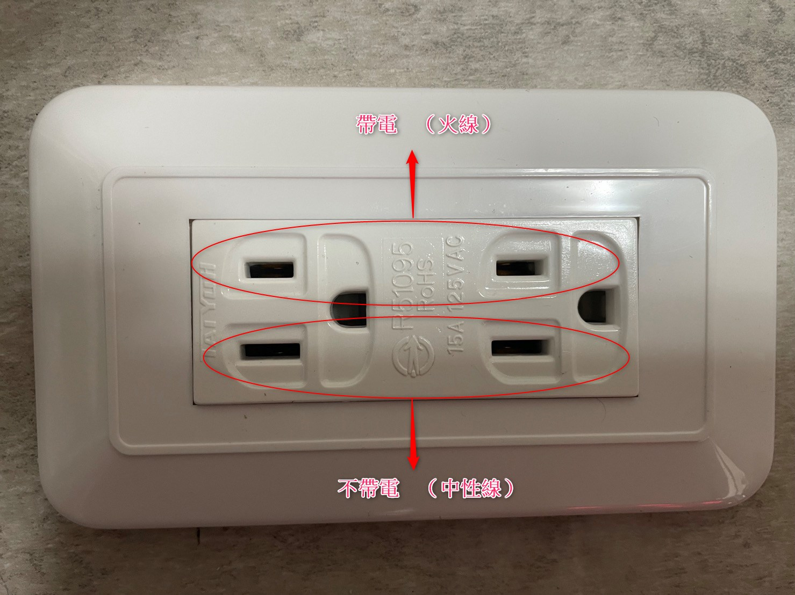

+++
author = "Hugo Authors"
title = "更換插座紀錄"
date = "2022-11-14"
#description = ""
#categories = [
#    ""
#]
#tags = [
#]
image = "100.jpg"
+++
    

   **步驟**
   
    1. 斷電 (記得要將插座電閘與漏電電閘斷掉) ps. 插座電閘在下面,沒拍到
    
   
   
    2. 將插座面板拆下,圖為面板背面 (拆下需將一字起插進橫向插孔再將線拔出即可)

   
   
    3. 將舊的面板拆下後,換上新面板 (記得一定不要插錯位置,不然短路後果會很嚴重 !!!!!)  
   
   
   
    4. 一定確定沒插錯後,再將面板鎖回去,將插座電閘與漏電電閘打開
    
   
   
    5. 插座面板: 短的帶電 (火線) 長的不帶電 (中性線)
   
  

***




