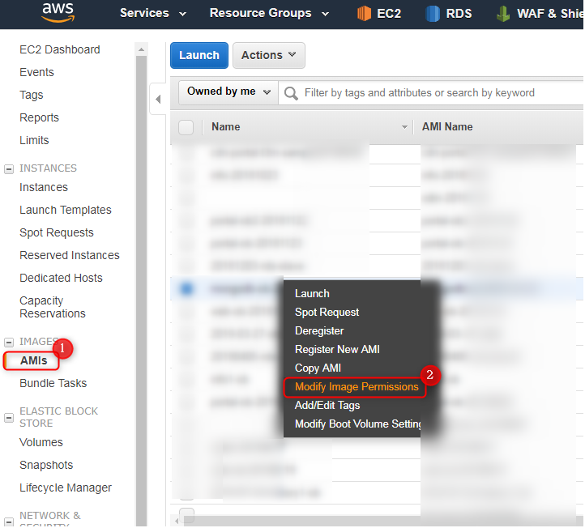
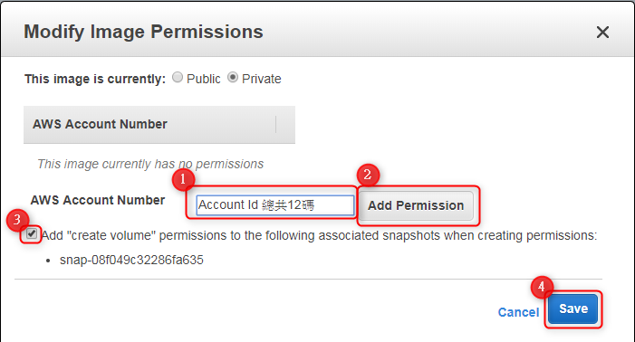
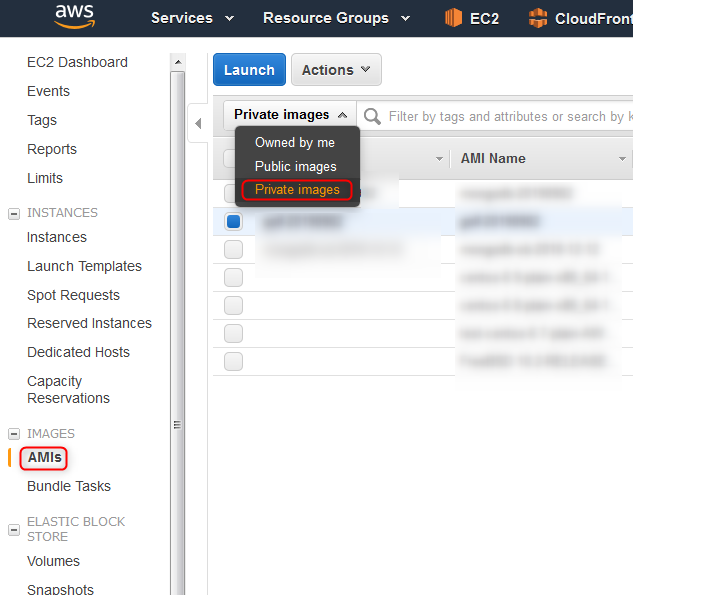

# AWS - AMIs 授權給其他帳號

<!--nore-->
"把原帳號的 AMIs 授權給新帳號，分享 Images 給新帳號使用"


# AWS 控制台

    
## 選擇AMIs > 點選 Modify Image Permissions    

   
   
## 輸入 新帳號的 Account Id >> Add Permission >> 下面的勾勾打勾 > save

   
   
## 再到新帳號的 AWS 控制台 >> EC2 >> AMIs >> private images 即可看到剛剛授權的 AMIs
    
   
   
   [官方文件](https://docs.aws.amazon.com/zh_tw/AWSEC2/latest/UserGuide/sharingamis-explicit.html)
   
   

***





---

> Author: Laurance  
> URL: https://laurance.eu.org/posts/aws-amis%E6%8E%88%E6%AC%8A%E7%B5%A6%E5%85%B6%E4%BB%96%E5%B8%B3%E8%99%9F/  

