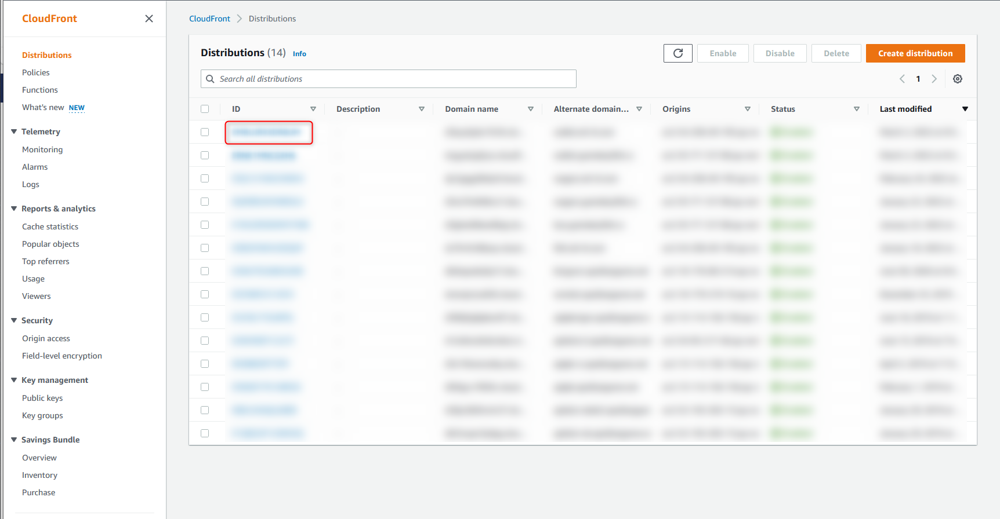
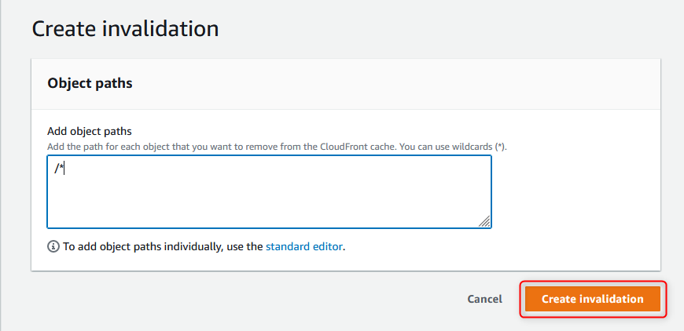

# AWS - Cloudfront CDN 快取清除

<!--more-->
"紀錄一下如何清除 Cloudfront CDN Cache"


## 到 AWS-Cloudfront 後台 選取要清除暫存的 SITE
    
   
   
## 選取 Invalidations 
    
   
   
## " /* " 表示清除所有 再點選Create invalidation即可
    
   
    

***





---

> Author: Laurance  
> URL: https://laurance.eu.org/posts/aws-cloudfront-cdn%E5%BF%AB%E5%8F%96%E6%B8%85%E9%99%A4/  

